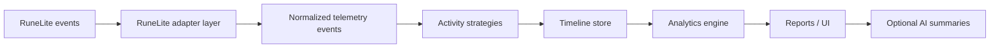
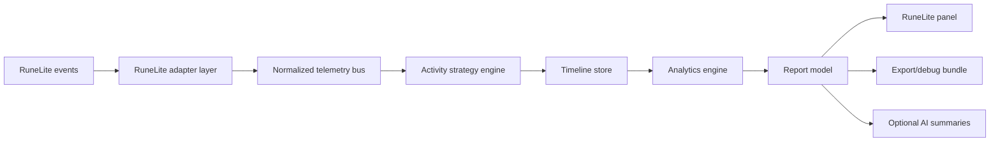
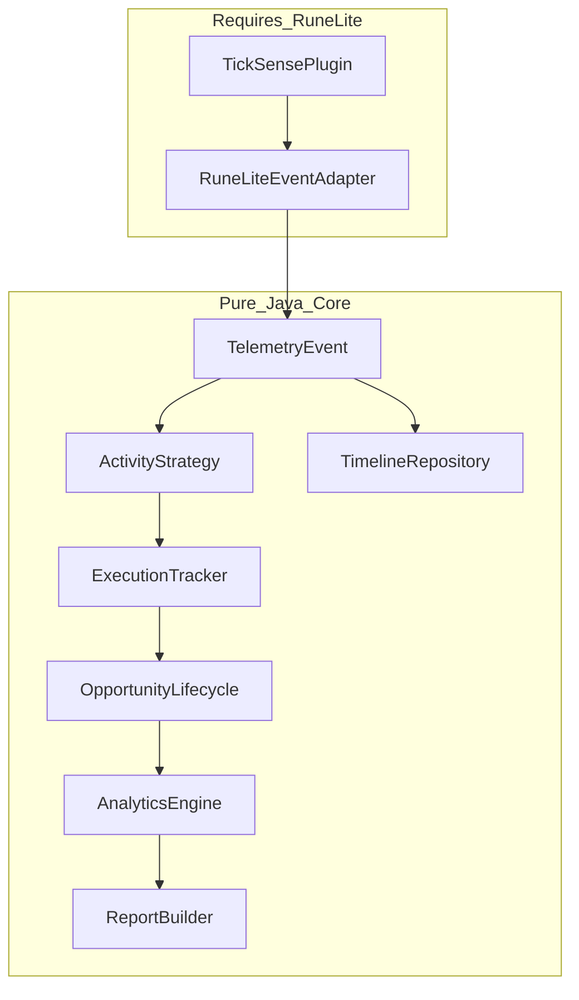
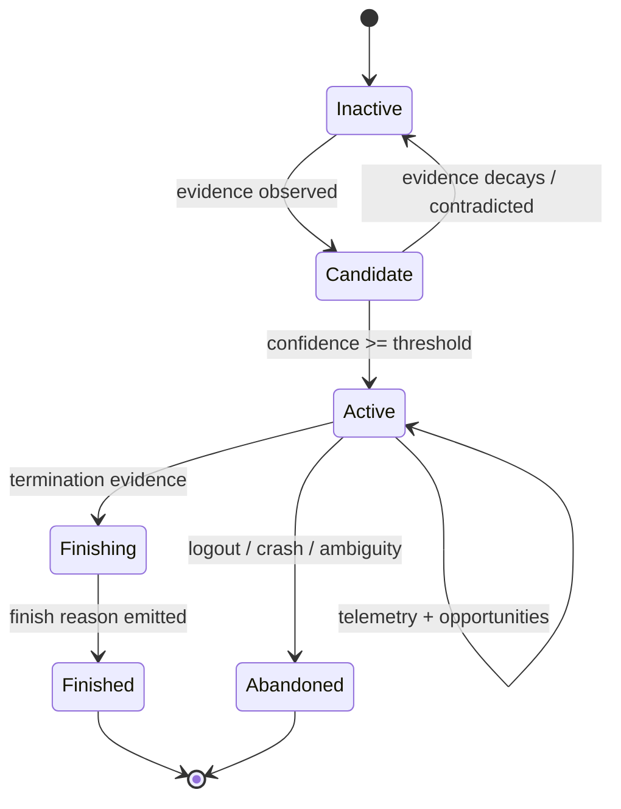

# 1. Executive Summary

TickSense is a retrospective execution analytics platform for Old School RuneScape, delivered as a RuneLite Plugin Hub plugin. It observes gameplay through public RuneLite APIs, normalizes those observations into replayable telemetry, detects completed activities, identifies execution opportunities, and generates post-activity reports showing where the player gained or lost ticks, seconds, or milliseconds.

TickSense answers: **“How well did I execute?”** It does not answer: **“What should I do next?”**

Its differentiator is not a boss overlay, timer, XP tracker, or real-time helper. The differentiator is a generic analytics pipeline plus activity-specific strategies. The same core should support Araxxor spider handling, Vardorvis response timing, Inferno prayer consistency, herb cleaning throughput, gem mining idle ticks, Construction menu efficiency, and future Sailing salvaging timings.

Core product characteristics:

- **Retrospective execution analytics:** analysis is shown after the activity, kill, wave, room, inventory cycle, or session.
- **Tick/second/millisecond review:** use game ticks for server-cycle execution, seconds for downtime, and milliseconds for client-observed reactions.
- **Automatic activity detection:** infer activity from regions, NPCs, widgets, inventory deltas, XP/stat changes, animations, projectiles, menu actions, and player state.
- **Activity-specific strategies:** each activity owns activation, opportunity detection, termination, metadata, and scoring.
- **Generic telemetry pipeline:** RuneLite events are converted to normalized events before analysis.
- **Not a real-time helper:** no live mechanic solving, no “click this now”, no generated input, and no live AI gameplay advice.

Required architecture:



Source audit highlights:

- RuneLite current event package docs verify the core event set used here: <https://static.runelite.net/runelite-api/apidocs/net/runelite/api/events/package-summary.html>
- `GameTick` is documented as once per game tick, approximately 0.6 seconds, after packets are processed: <https://static.runelite.net/runelite-api/apidocs/net/runelite/api/events/GameTick.html>
- `ClientTick` is documented as a 20ms client tick: <https://static.runelite.net/runelite-api/apidocs/net/runelite/api/events/ClientTick.html>
- RuneLite development docs currently target Java/JDK 11: <https://github.com/runelite/runelite/wiki/Building-with-IntelliJ-IDEA>
- Plugin Hub workflow and template guidance live in the Plugin Hub repository: <https://github.com/runelite/plugin-hub>
- RuneLite rejected/rolled-back feature guidance warns against native/JNI, reflection, subprocesses, runtime-downloaded code, and non-Java plugins: <https://github.com/runelite/runelite/wiki/Rejected-or-Rolled-Back-Features>
- Jagex rules prohibit generated input, direct game-world communication, traffic inspection/modification, client modification, and software that performs in-game actions for the player: <https://legal.jagex.com/docs/rules/rules-of-old-school-runescape/> and <https://legal.jagex.com/docs/rules/macroing/>

Important correction: `MapRegionChanged` was requested for research, but it does **not** appear in the current `net.runelite.api.events` package summary. Region changes should be inferred from `GameStateChanged`, `WorldViewLoaded`, `WorldViewUnloaded`, player location/region snapshots, and current `WorldView` APIs. Any claimed `MapRegionChanged` use is **Needs verification in RuneLite Dev Tools**.

# 2. Product Vision

TickSense is for players who already know the intended strategy and want evidence about their execution. The player should enable the plugin, play normally, and review a report after completion.

The player-facing framing should be simple:

```text
Activity finished.
Here is where you lost ticks.
Here is your best execution.
Here is your worst execution.
Here is the repeated pattern across recent attempts.
```

## Examples

### Araxxor spider handling

Post-kill report:

```text
Araxxor kill: 2:11.4 / 219 ticks
Spider opportunities: 5
Median spider engagement: 1 tick
Worst spider engagement: 3 ticks
Boss re-engagement loss: 4 ticks
Damage taken during spider windows: 28
```

TickSense should not show “attack spider now” during the fight.

### Vardorvis mechanic response

Post-kill report can measure ranged-head response, blood-splat movement latency, axe dodge timing, prayer response, damage during mechanic windows, and downtime. The strategy must verify projectile/graphic/animation IDs in Dev Tools before claiming exact timings.

### Inferno prayer flick consistency

After a wave or attempt, TickSense can summarize flick timing, early/late distribution, blob solve latency, nibbler response, wave duration, pillar downtime, supply usage, and death timeline. Existing Inferno plugins are useful references, but TickSense should avoid becoming a live solver.

### Herb cleaning throughput

Post-session report:

```text
Herb cleaning session
Inventories: 14
Herbs cleaned: 392
Best inventory: 16.8s
Median inventory: 18.2s
Throughput: 5,540/hr active
Idle after inventories: 43.1s
Redundant clicks: 17
```

### Gem mining tick loss

Report rock-respawn-to-click latency, idle ticks, redundant clicks, movement latency, and mining cycle consistency. Separate player execution from mining RNG.

### Construction menu efficiency

Report build/remove menu latency, build/remove cadence, banking or servant downtime, and inventory cycle duration. Observe menus/widgets only. Do not inject, reorder, or automate actions.

### Sailing salvaging response timings

Future Sailing strategies should treat IDs and mechanics as volatile. Measure salvage target availability, interaction latency, movement delay, XP/inventory confirmation, and expiry/failure only after verifying current RuneLite-visible evidence.

# 3. Safety and RuneLite Compliance Philosophy

TickSense observes and reports. It does not play.

## What is allowed

The safe product lane is:

- Observe public RuneLite API events.
- Snapshot local state exposed through RuneLite APIs.
- Persist local, user-owned timeline/report files.
- Analyze completed activities retrospectively.
- Display local reports in a RuneLite panel.
- Export debug bundles only when user-requested.
- Optionally summarize completed reports with AI in a future opt-in feature.

## What is risky

| Area | Risk | TickSense rule |
|---|---:|---|
| Generated input | Directly conflicts with Jagex macroing/client rules | Never generate clicks, keypresses, or mouse movement. |
| Live mechanic guidance | Can become “click/pray/move now” assistance | No real-time solver overlays. |
| Menu mutation | Can change execution | Observe menu events only. Do not consume, swap, inject, or reorder. |
| Projectile alteration | Live visual mechanics changes can be sensitive | Observe projectiles only. Do not replace or recolor them. |
| Networking | Privacy and Plugin Hub review burden | No networking in MVP. AI is later and opt-in. |
| SQLite JDBC | Common Java driver loads native code/JNI | Avoid for Plugin Hub MVP. Use JSONL-first storage. |
| Arbitrary user IDs | ID-based solver behavior can be rejected | Keep reviewed ID registries in source; no arbitrary mechanic rule packs. |

## Why retrospective analytics is safer

Retrospective analytics separates recording from decision support. The plugin can record that a spider spawned, that the player clicked it two ticks later, and that damage was taken during the window. It should wait until the activity ends before interpreting that as execution loss.

This does not make every feature automatically acceptable. The plugin must still avoid hidden information, packet/memory inspection, generated input, live solution prompts, and networked live coaching.

## Non-goals and hard bans

TickSense will not do these:

- No generated clicks.
- No keypress automation.
- No real-time mechanic solving.
- No “click this now” overlays.
- No live tile/prayer/target prescriptions.
- No memory reading.
- No game traffic inspection.
- No packet inspection.
- No interaction with Jagex game worlds outside the RuneLite client.
- No external process control.
- No runtime-downloaded analyzer code.
- No HTTP server exposing player/game state.
- No live AI gameplay advice.

## AI/network privacy rule

If AI summaries are added later, AI receives completed report JSON, not live raw game state. Payloads must be explicit, minimized, redacted, opt-in, and reviewable by Plugin Hub maintainers.

# 4. Existing Plugin and GitHub Research

## Source audit method

APIs and capabilities in this document are treated as verified only if checked against RuneLite API docs, RuneLite source, official RuneLite wiki/Plugin Hub docs, official Jagex rules, or existing open-source RuneLite plugin implementations. Otherwise they are marked **Needs verification in RuneLite Dev Tools**.

## Name and plugin collision check: TickSense

No public RuneLite Plugin Hub or OSRS-specific collision was found for `TickSense`. GitHub repository search did find unrelated public repositories using the name or close variants:

- <https://github.com/cpaccione/ticksense>
- <https://github.com/AndrewAct/ticksense>
- <https://github.com/AndrewAct/ticksense-ui>
- <https://github.com/peteremeka753-maker/TickSense>

Assessment: the name appears safe enough for a RuneLite Plugin Hub display name, but it is not globally unique. Re-check Plugin Hub, GitHub, OSRS community tools, and public Discord/community references immediately before publishing.

Fallback names:

1. TickLedger
2. TickReview
3. TickTrace
4. AfterTick
5. RuneTempo

## Useful plugin/source references

| Plugin | Source files | What it does | Why TickSense should study it | Overlap |
|---|---|---|---|---|
| RuneLite NPC Indicators | <https://github.com/runelite/runelite/blob/master/runelite-client/src/main/java/net/runelite/client/plugins/npchighlight/NpcIndicatorsPlugin.java>, <https://github.com/runelite/runelite/blob/master/runelite-client/src/main/java/net/runelite/client/plugins/npchighlight/NpcRespawnOverlay.java> | Tracks NPC spawns, despawns, changes, respawns, menu entries, highlights. | NPC lifecycle bookkeeping, stale NPC cleanup, `NpcSpawned`, `NpcDespawned`, `NpcChanged`, `GameTick`, `MenuEntryAdded`, `WorldView`. | Implementation overlap only. TickSense should not highlight live targets. |
| RuneLite Ground Items | <https://github.com/runelite/runelite/blob/master/runelite-client/src/main/java/net/runelite/client/plugins/grounditems/GroundItemsPlugin.java> | Tracks ground item spawns/despawns/quantity changes and menu entries. | Item lifecycle indexing and world-view cleanup. | Useful for loot/environment evidence. |
| RuneLite Loot Tracker | <https://github.com/runelite/runelite/blob/master/runelite-client/src/main/java/net/runelite/client/plugins/loottracker/LootTrackerPlugin.java> | Tracks loot, server loot events, widgets, profile/session state, panel data. | Persistence, report-like UI, post-client-tick handling, instance considerations. | Partial. It reports rewards, not execution. |
| RuneLite XP Tracker | <https://github.com/runelite/runelite/blob/master/runelite-client/src/main/java/net/runelite/client/plugins/xptracker/XpTrackerPlugin.java>, <https://github.com/runelite/runelite/blob/master/runelite-client/src/main/java/net/runelite/client/plugins/xptracker/XpState.java>, <https://github.com/runelite/runelite/blob/master/runelite-client/src/main/java/net/runelite/client/plugins/xptracker/XpPanel.java> | Tracks XP, skill sessions, rates, panel state. | `StatChanged`, `GameTick`, skill-session state, panel patterns. | Medium for skilling metrics. |
| RuneLite Boss Timers | <https://github.com/runelite/runelite/blob/master/runelite-client/src/main/java/net/runelite/client/plugins/bosstimer/BossTimersPlugin.java> | Detects boss death/despawn and creates respawn timers. | Boss death/despawn heuristics. | Termination evidence only. |
| RuneLite Timers and Buffs | <https://github.com/runelite/runelite/blob/master/runelite-client/src/main/java/net/runelite/client/plugins/timersandbuffs/TimersAndBuffsPlugin.java> | Manages timers/buffs from ticks, graphics, NPCs, item containers, regions, chat. | Tick timers, region constants, multi-event derived state. | Some implementation overlap; product is live timers, not retrospective analytics. |
| RuneLite Mining | <https://github.com/runelite/runelite/blob/master/runelite-client/src/main/java/net/runelite/client/plugins/mining/MiningPlugin.java> | Tracks mining state. | Mining animations, skilling state, idle timeout patterns. | Medium for gem mining. |
| RuneLite Dev Tools | <https://github.com/runelite/runelite/blob/master/runelite-client/src/main/java/net/runelite/client/plugins/devtools/DevToolsPlugin.java> | Shows IDs and development context. | ID discovery and verification. | Required developer tool. |
| Inferno Stats | <https://github.com/runelite/plugin-hub/blob/master/plugins/inferno-stats>, <https://github.com/InfernoStats/InfernoStats/blob/master/src/main/java/com/infernostats/InfernoStatsPlugin.java> | In-depth stats for Inferno attempts. | Closest narrow-domain retrospective stats reference; wave/run state, tick-loss concepts, panel/navbutton. | High for Inferno only. Not generic TickSense. |
| Vardorvis Projectiles | <https://github.com/runelite/plugin-hub/blob/master/plugins/vardorvis-projectiles>, <https://github.com/InfernoStats/vardorvis-projectiles/blob/master/src/main/java/com/infernostats/VardorvisProjectilesPlugin.java> | Uses `ProjectileMoved` and known projectile IDs to alter Vardorvis projectile visuals. | Projectile event handling and content-specific projectile IDs. | TickSense should observe only, not alter projectiles. |

## Does an existing plugin already do this?

No exact match was found. Inferno Stats is the closest discovered overlap, but it is domain-specific. RuneLite core plugins provide many building blocks—NPC tracking, item tracking, loot/session tracking, XP tracking, timers, panels, persistence, event handling—but no discovered plugin provides a generic cross-activity retrospective execution analytics platform built around normalized telemetry, activity strategies, opportunities, and post-activity reports.

# 5. RuneLite Development Environment

## Java version

RuneLite’s current IntelliJ build guide says to use JDK 11 / Java 11. Do not use Java records or newer Java language features in Plugin Hub code unless RuneLite’s target changes. Use Java 11-safe immutable classes instead.

Official guide: <https://github.com/runelite/runelite/wiki/Building-with-IntelliJ-IDEA>

## Gradle and template setup

Start from the official external plugin template and Plugin Hub README:

- Plugin Hub: <https://github.com/runelite/plugin-hub>
- Example plugin: <https://github.com/runelite/example-plugin>

Setup checklist:

1. Clone the example plugin.
2. Rename package to `com.ticksense` or `dev.ticksense`.
3. Rename main class to `TickSensePlugin`.
4. Set `@PluginDescriptor(name = "TickSense")`.
5. Update `runelite-plugin.properties` with the main class.
6. Add `TickSenseConfig` and a minimal side panel.
7. Run `./gradlew test` and `./gradlew run`.
8. Submit to Plugin Hub by adding a `plugins/ticksense` manifest with `repository=` and `commit=`.

## IntelliJ workflow

- Import as a Gradle project.
- Set Gradle JVM to JDK 11.
- Run the template `run` task.
- Enable RuneLite Dev Tools for ID and widget inspection.
- Use captured JSONL timelines for replay tests.

## Testing setup

Use three layers:

1. Pure core tests with synthetic normalized events.
2. Replay tests from captured JSONL timelines.
3. Thin RuneLite adapter tests with mocks/stubs where practical.

Most TickSense logic must run without RuneLite.

# 6. RuneLite API Surface Research

Status legend:

| Status | Meaning |
|---|---|
| Verified | Present in current RuneLite API docs/source or RuneLite source. |
| Verified but deprecated | Present but docs indicate a newer preferred API. |
| Inferred | Not a direct API; can be derived from verified APIs. |
| Needs verification in RuneLite Dev Tools | Useful but not cleanly documented or content-specific. |

## Core events and APIs

| Name | Package/class | What it represents / when it fires | Timing implications | TickSense use | Docs/source | Status |
|---|---|---|---|---|---|---|
| `GameTick` | `net.runelite.api.events.GameTick` | Posted once per OSRS game tick after packets process. | Anchor for server-cycle/tick-loss metrics. | Tick index, idle ticks, opportunity windows, activity clocks. | <https://static.runelite.net/runelite-api/apidocs/net/runelite/api/events/GameTick.html>, <https://github.com/runelite/runelite/blob/master/runelite-api/src/main/java/net/runelite/api/events/GameTick.java> | Verified |
| `ClientTick` | `net.runelite.api.events.ClientTick` | Client-side tick, documented as 20ms. | Useful for millisecond-level ordering, not server tick logic. | Reaction timing, menu latency, click cadence. | <https://static.runelite.net/runelite-api/apidocs/net/runelite/api/events/ClientTick.html>, <https://github.com/runelite/runelite/blob/master/runelite-api/src/main/java/net/runelite/api/events/ClientTick.java> | Verified |
| `PostClientTick` | `net.runelite.api.events.PostClientTick` | Posted after client tick processing. | Good flush/coalescing point. | End-of-client-cycle buffered event flush. | <https://static.runelite.net/runelite-api/apidocs/net/runelite/api/events/PostClientTick.html>, <https://github.com/runelite/runelite/blob/master/runelite-api/src/main/java/net/runelite/api/events/PostClientTick.java> | Verified |
| `GameStateChanged` | `net.runelite.api.events.GameStateChanged` | Client state transition: loading, logged in, login screen, hop/disconnect flows. | Activity/session boundary; not a clock. | Start/end sessions, terminate activities on logout/hop/loading. | <https://static.runelite.net/runelite-api/apidocs/net/runelite/api/events/GameStateChanged.html>, <https://github.com/runelite/runelite/blob/master/runelite-api/src/main/java/net/runelite/api/events/GameStateChanged.java> | Verified |
| `MapRegionChanged` | Requested event name | Not present in current `net.runelite.api.events` package summary. | Do not build against it. | Replace with world-view/region snapshots and location evidence. | <https://static.runelite.net/runelite-api/apidocs/net/runelite/api/events/package-summary.html> | Needs verification / not current public event |
| `MenuOptionClicked` | `net.runelite.api.events.MenuOptionClicked` | Player selected a menu option. | Best user-intent timestamp; attach tick and wall time. | Attack clicks, object/item/widget clicks, banking/menu actions. | <https://static.runelite.net/runelite-api/apidocs/net/runelite/api/events/MenuOptionClicked.html>, <https://github.com/runelite/runelite/blob/master/runelite-api/src/main/java/net/runelite/api/events/MenuOptionClicked.java> | Verified; observe-only |
| `MenuEntryAdded` | `net.runelite.api.events.MenuEntryAdded` | Menu entry added while menu is built. | Availability evidence before action. | Detect available actions, opportunity candidates, misclick context. | <https://static.runelite.net/runelite-api/apidocs/net/runelite/api/events/MenuEntryAdded.html>, <https://github.com/runelite/runelite/blob/master/runelite-api/src/main/java/net/runelite/api/events/MenuEntryAdded.java> | Verified; observe-only |
| `MenuOpened` | `net.runelite.api.events.MenuOpened` | Context menu opened. | UI latency evidence. | Construction/banking/right-click flow timing. | <https://static.runelite.net/runelite-api/apidocs/net/runelite/api/events/MenuOpened.html>, <https://github.com/runelite/runelite/blob/master/runelite-api/src/main/java/net/runelite/api/events/MenuOpened.java> | Verified |
| `AnimationChanged` | `net.runelite.api.events.AnimationChanged` | Actor animation changed. | Often tick-aligned; exact semantics content-specific. | Skilling starts, boss attacks, player actions, prayer models. | <https://static.runelite.net/runelite-api/apidocs/net/runelite/api/events/AnimationChanged.html>, <https://github.com/runelite/runelite/blob/master/runelite-api/src/main/java/net/runelite/api/events/AnimationChanged.java> | Verified; IDs need verification |
| `GraphicChanged` | `net.runelite.api.events.GraphicChanged` | Actor graphic changed. | Mechanic/effect evidence; not always mechanic start. | Vardorvis/Inferno effects, skilling graphics, damage context. | <https://static.runelite.net/runelite-api/apidocs/net/runelite/api/events/GraphicChanged.html>, <https://github.com/runelite/runelite/blob/master/runelite-api/src/main/java/net/runelite/api/events/GraphicChanged.java> | Verified; IDs need verification |
| `GraphicsObjectCreated` | `net.runelite.api.events.GraphicsObjectCreated` | Graphics object created in scene. | Useful for area/tile mechanics if exposed. | Blood splats, area effects, environmental triggers. | <https://static.runelite.net/runelite-api/apidocs/net/runelite/api/events/GraphicsObjectCreated.html>, <https://github.com/runelite/runelite/blob/master/runelite-api/src/main/java/net/runelite/api/events/GraphicsObjectCreated.java> | Verified; mechanics need verification |
| `ProjectileMoved` | `net.runelite.api.events.ProjectileMoved` | Projectile movement/update. | Client-observed projectile timing; not always exact mechanic start. | Vardorvis ranged head, Inferno attacks, projectile-based opportunities. | <https://static.runelite.net/runelite-api/apidocs/net/runelite/api/events/ProjectileMoved.html>, <https://github.com/runelite/runelite/blob/master/runelite-api/src/main/java/net/runelite/api/events/ProjectileMoved.java> | Verified; reliability per boss needs verification |
| `HitsplatApplied` | `net.runelite.api.events.HitsplatApplied` | Hitsplat applied to an actor. | Damage confirmation, often after cause. | Damage during opportunity, kill/death evidence, failure attribution. | <https://static.runelite.net/runelite-api/apidocs/net/runelite/api/events/HitsplatApplied.html>, <https://github.com/runelite/runelite/blob/master/runelite-api/src/main/java/net/runelite/api/events/HitsplatApplied.java> | Verified |
| `InteractingChanged` | `net.runelite.api.events.InteractingChanged` | Actor target changed. | Confirms engagement after click/action. | Spider/boss re-engagement, target switching, downtime. | <https://static.runelite.net/runelite-api/apidocs/net/runelite/api/events/InteractingChanged.html>, <https://github.com/runelite/runelite/blob/master/runelite-api/src/main/java/net/runelite/api/events/InteractingChanged.java> | Verified |
| `NpcSpawned` | `net.runelite.api.events.NpcSpawned` | NPC spawned. | Activity/opportunity evidence. | Boss start, spider spawn, nibbler spawn, waves. | <https://static.runelite.net/runelite-api/apidocs/net/runelite/api/events/NpcSpawned.html>, <https://github.com/runelite/runelite/blob/master/runelite-api/src/main/java/net/runelite/api/events/NpcSpawned.java> | Verified |
| `NpcDespawned` | `net.runelite.api.events.NpcDespawned` | NPC despawned. | Completion/termination evidence; despawn != death by itself. | Boss/spider end, wave transitions. | <https://static.runelite.net/runelite-api/apidocs/net/runelite/api/events/NpcDespawned.html>, <https://github.com/runelite/runelite/blob/master/runelite-api/src/main/java/net/runelite/api/events/NpcDespawned.java> | Verified |
| `NpcChanged` | `net.runelite.api.events.NpcChanged` | NPC composition/transform changed. | Phase/form evidence. | Boss phases, spawned variants, special mechanics. | <https://static.runelite.net/runelite-api/apidocs/net/runelite/api/events/NpcChanged.html>, <https://github.com/runelite/runelite/blob/master/runelite-api/src/main/java/net/runelite/api/events/NpcChanged.java> | Verified |
| `ItemContainerChanged` | `net.runelite.api.events.ItemContainerChanged` | Inventory/equipment/bank/container changed. | Confirmation signal after action. | Herbs, supplies, gear switches, Construction inventory cycles. | <https://static.runelite.net/runelite-api/apidocs/net/runelite/api/events/ItemContainerChanged.html>, <https://github.com/runelite/runelite/blob/master/runelite-api/src/main/java/net/runelite/api/events/ItemContainerChanged.java> | Verified |
| `ItemSpawned` | `net.runelite.api.events.ItemSpawned` | Ground item spawned. | Environmental/loot evidence. | Loot timing, dropped supplies, spawned resources. | <https://static.runelite.net/runelite-api/apidocs/net/runelite/api/events/ItemSpawned.html>, <https://github.com/runelite/runelite/blob/master/runelite-api/src/main/java/net/runelite/api/events/ItemSpawned.java> | Verified |
| `ItemDespawned` | `net.runelite.api.events.ItemDespawned` | Ground item despawned. | Environmental cleanup. | Loot pickup/expire context. | <https://static.runelite.net/runelite-api/apidocs/net/runelite/api/events/ItemDespawned.html>, <https://github.com/runelite/runelite/blob/master/runelite-api/src/main/java/net/runelite/api/events/ItemDespawned.java> | Verified |
| `ItemQuantityChanged` | `net.runelite.api.events.ItemQuantityChanged` | Ground item quantity changed. | Quantity lifecycle evidence. | Loot/item stack analysis. | <https://static.runelite.net/runelite-api/apidocs/net/runelite/api/events/ItemQuantityChanged.html>, <https://github.com/runelite/runelite/blob/master/runelite-api/src/main/java/net/runelite/api/events/ItemQuantityChanged.java> | Verified |
| `StatChanged` | `net.runelite.api.events.StatChanged` | XP/stat changed. | Confirms skilling success; not click start. | Herb cleaning, mining, Construction, Sailing evidence. | <https://static.runelite.net/runelite-api/apidocs/net/runelite/api/events/StatChanged.html>, <https://github.com/runelite/runelite/blob/master/runelite-api/src/main/java/net/runelite/api/events/StatChanged.java> | Verified |
| Widget events | `WidgetLoaded`, `WidgetClosed`, `WidgetDrag`, `WidgetMenuOptionClicked`, `WidgetPressed` if present in package | UI lifecycle/interactions. | Client UI timing; widget IDs are content-specific. | Bank, Construction menus, reward screens, report-ready evidence. | <https://static.runelite.net/runelite-api/apidocs/net/runelite/api/events/WidgetLoaded.html>, <https://static.runelite.net/runelite-api/apidocs/net/runelite/api/widgets/Widget.html> | Verified category; IDs need verification |
| Player APIs | `Client.getLocalPlayer()`, `Player`, `Actor`, `WorldView.players()` | Local and other players as actors. | Snapshot state; not every property has a dedicated event. | Player animation, target, movement, death, health. | <https://static.runelite.net/runelite-api/apidocs/net/runelite/api/Client.html>, <https://static.runelite.net/runelite-api/apidocs/net/runelite/api/Player.html>, <https://static.runelite.net/runelite-api/apidocs/net/runelite/api/Actor.html> | Verified |
| NPC APIs | `NPC`, `Actor`, `WorldView.npcs()` | NPC actors and composition/state. | NPC index can be reused; snapshot carefully. | Bosses, spiders, waves, target state. | <https://static.runelite.net/runelite-api/apidocs/net/runelite/api/NPC.html>, <https://static.runelite.net/runelite-api/apidocs/net/runelite/api/Actor.html> | Verified |
| WorldPoint/location APIs | `WorldPoint`, `LocalPoint` | World/local position and region context. | Movement needs click time plus later position confirmation. | Movement response, region detection, object/NPC proximity. | <https://static.runelite.net/runelite-api/apidocs/net/runelite/api/coords/WorldPoint.html> | Verified |
| Instance/region APIs | `WorldView`, `WorldViewLoaded`, `WorldViewUnloaded`, `Client.getTopLevelWorldView()`; deprecated `Client.getMapRegions()`, `Client.isInInstancedRegion()` | World-view and instance context. | Activity start/end evidence. Prefer current WorldView APIs. | Boss instances, Inferno region, raids/minigames. | <https://static.runelite.net/runelite-api/apidocs/net/runelite/api/Client.html>, <https://static.runelite.net/runelite-api/apidocs/net/runelite/api/events/WorldViewLoaded.html>, <https://static.runelite.net/runelite-api/apidocs/net/runelite/api/events/WorldViewUnloaded.html> | Verified; legacy methods deprecated |
| Inventory/equipment APIs | `Client.getItemContainer(InventoryID)`, `InventoryID`, `ItemID`, `ItemContainerChanged` | Inventory/equipment/container contents. | Confirmation signal; not action start. | Supplies, herbs, equipment, banking cycles. | <https://static.runelite.net/runelite-api/apidocs/net/runelite/api/InventoryID.html>, <https://static.runelite.net/runelite-api/apidocs/net/runelite/api/ItemID.html> | Verified |
| FPS/world/tick APIs | `Client.getFPS()`, `Client.getWorld()`, `Client.getTickCount()` | Client FPS, current world, server tick count. | Context metadata. | Report context and uncertainty. | <https://static.runelite.net/runelite-api/apidocs/net/runelite/api/Client.html> | Verified |
| Ping | No simple `Client.getPing()` found in current docs; `WorldService.getWorlds()` exists. | World latency, if later verified. | Do not invent. | Record only if a supported API is verified. | <https://static.runelite.net/runelite-client/apidocs/net/runelite/client/game/WorldService.html> | Needs verification |

## Important limitations

RuneLite does not expose a clean event for every gameplay concept TickSense wants. The strategy layer must infer carefully.

| Desired concept | Direct API? | Recommended inference |
|---|---:|---|
| Player intended to attack spider | Partial | `MenuOptionClicked` targeting spider plus `InteractingChanged(local -> spider)`. |
| Spider became attackable | Partial | `NpcSpawned`/`NpcChanged`, menu availability, health/combat state, location. Needs live verification. |
| Correct prayer flick window | No generic API | Activity-specific attack-cycle model, prayer state verification, animations/projectiles. |
| Misclick | No | Wrong target/action plus correction click plus no expected state transition. Mark as likely, not certain. |
| Boss mechanic solved | No | Mechanic trigger, expected response evidence, no/fewer hitsplats, state transition. |
| Region changed | No `MapRegionChanged` in current docs | Track `WorldViewLoaded/Unloaded`, game state, player `WorldPoint`, region snapshots. |
| Network ping | No simple client API found | Omit or verify experimentally; record FPS/world instead. |
| End-to-end input latency | No | Approximate with menu click time, client tick, game tick, and confirmation event. |

# 7. ID and Game Data Research

TickSense needs stable management for NPC IDs, object IDs, animation IDs, graphic IDs, projectile IDs, widget IDs, region IDs, instanced-region mappings, and item IDs. Do not scatter constants through strategies.

## Sources and tools

| ID type | Preferred source | TickSense use | Maintenance risk |
|---|---|---|---|
| NPC IDs | `NpcID`, Dev Tools, existing plugin code | Bosses, spiders, Inferno NPCs, targets | Medium; variants/forms change. |
| Object IDs | `ObjectID`, Dev Tools | Rocks, Construction objects, salvage targets | Medium/high. |
| Animation IDs | `AnimationID` where available, Dev Tools, captured timelines | Player/boss actions | High; many useful IDs are unnamed. |
| Graphic IDs | `GraphicID` where available, Dev Tools, captured timelines | Mechanics/effects | High. |
| Projectile IDs | Dev Tools, captured timelines, existing plugin code | Vardorvis/Inferno mechanics | High. |
| Widget IDs | `WidgetID`, Dev Tools | Bank, Construction, rewards | Medium/high. |
| Region IDs | `WorldPoint`, Dev Tools, existing plugins | Activity activation/termination | Medium. |
| Item IDs | `ItemID`, Dev Tools | Herbs, gems, supplies, equipment | Low/medium. |

Useful official docs:

- `NpcID`: <https://static.runelite.net/runelite-api/apidocs/net/runelite/api/NpcID.html>
- `ObjectID`: <https://static.runelite.net/runelite-api/apidocs/net/runelite/api/ObjectID.html>
- `ItemID`: <https://static.runelite.net/runelite-api/apidocs/net/runelite/api/ItemID.html>
- `AnimationID`: <https://static.runelite.net/runelite-api/apidocs/net/runelite/api/AnimationID.html>
- `GraphicID`: <https://static.runelite.net/runelite-api/apidocs/net/runelite/api/GraphicID.html>
- `WidgetID`: <https://static.runelite.net/runelite-api/apidocs/net/runelite/api/widgets/WidgetID.html>
- Dev Tools source: <https://github.com/runelite/runelite/blob/master/runelite-client/src/main/java/net/runelite/client/plugins/devtools/DevToolsPlugin.java>

## ID registry pattern

```java
public final class AraxxorIds
{
    private static final IntIdSet ARAXXOR_NPC_IDS = IntIdSet.of(
        NpcID.ARAXXOR,
        NpcID.ARAXXOR_13669);

    private AraxxorIds() {}

    public static boolean isAraxxorNpcId(int npcId)
    {
        return ARAXXOR_NPC_IDS.contains(npcId);
    }
}
```

Rules:

- Each committed primitive ID must include a source comment: Dev Tools verification date, replay fixture evidence, or existing plugin source.
- Use RuneLite constants such as `NpcID.ARAXXOR`, `ItemID.PRAYER_POTION4`, or `ObjectID.LARDER_SPACE` inside activity ID catalogs whenever the pinned RuneLite API exposes a named constant.
- Keep primitive IDs only for source-owned replay/devtools evidence that does not have a suitable RuneLite constant, such as verified region IDs or fixture-specific widget children.
- Prefer intent methods such as `isAraxxorNpcId(int)` or `hasVerifiedRegionIds()` over exposing collections for caller-side membership checks.
- Keep raw arrays only for fixture snapshots, iteration, or injectable strategy seams.
- Keep ID registries small and reviewed.
- Avoid arbitrary user-supplied mechanic IDs.
- Log unknown IDs in debug diagnostics when inside a candidate activity.
- Add replay tests for each ID-dependent strategy.

## Instanced region mapping

Use `WorldView` first. Current `Client.getMapRegions()`, `Client.isInInstancedRegion()`, and related helpers are deprecated in current API docs in favor of world-view APIs.

Recommended per-tick snapshot:

```text
world number
local player world point
region ID derived from world point
world view ID/context
is instance if exposed by WorldView
loaded/unloaded world-view events
```

Do not use `MapRegionChanged` unless verified; it is not in current event docs.

## Maintenance after game updates

1. Run TickSense with debug capture after OSRS updates affecting supported content.
2. Capture at least one known activity timeline.
3. Diff observed IDs against registry.
4. Mark changed or unknown IDs.
5. Update registry and golden tests.
6. Add a changelog entry with verification source.

# 8. Core Architecture

## High-level design



## Component boundaries

| Component | Responsibility | Must not do |
|---|---|---|
| RuneLite adapter | Subscribe to RuneLite events, snapshot required fields, emit normalized telemetry. | No activity analytics beyond simple mapping. |
| Telemetry bus | Fan out immutable normalized events. | No RuneLite `NPC`, `Player`, `Client`, or `Widget` objects. |
| Activity strategy engine | Candidate scoring, active session lifecycle, opportunity routing. | No Swing/UI or file writes. |
| Timeline store | Append normalized events and activity/opportunity markers. | No gameplay interpretation. |
| Analytics engine | Compute completed-report metrics. | No RuneLite dependency. |
| Report model | Stable UI/export data. | No raw live objects. |
| UI | Display reports and settings. | No live mechanic instructions. |
| AI layer | Future opt-in post-report summaries. | No live advice or raw live state. |

## Why RuneLite types must not leak into core

RuneLite API objects are live, mutable, runtime-bound, and sometimes invalid after despawn or scene changes. A strategy that stores `NPC` or `Widget` directly will be hard to test and may break on lifecycle edges. The adapter should snapshot only values TickSense needs: IDs, names, positions, animations, graphics, projectiles, menu options, inventory deltas, tick index, client timing, and safe metadata.

## Testability boundary



## ADRs

### ADR-1: Normalize telemetry instead of using RuneLite events directly

**Decision:** The core consumes `TelemetryEvent`, not RuneLite events.

**Rationale:** Normalized events are immutable, serializable, replayable, and testable without RuneLite.

**Alternatives considered:** direct RuneLite events, per-activity plugin classes, serializing RuneLite objects.

**Consequences:** more mapper code, but much better tests, replays, diagnostics, and future report/AI exports.

### ADR-2: Activities own lifecycle

**Decision:** Each `ActivityStrategy` owns activation, opportunity detection, termination, and activity metadata.

**Rationale:** Araxxor, herb cleaning, Inferno, Construction, and mining have different evidence and end conditions.

**Alternatives:** one global detector, manual start/stop only, pure region detection.

**Consequences:** strategies need confidence scoring and tests; new activities remain isolated.

### ADR-3: Opportunities are central

**Decision:** Metrics are built around opportunity instances.

**Rationale:** Execution quality is measured at meaningful windows: spider spawn, rock respawn, menu open, prayer window, blood splat, inventory item availability.

**Alternatives:** raw timelines only, XP/hour only, bespoke per-activity metrics only.

**Consequences:** higher modeling effort, but reusable latency/tick-loss/score metrics.

### ADR-4: Analysis is retrospective

**Decision:** Analysis and coaching language appear after activity completion.

**Rationale:** Clearer compliance boundary and clearer product identity.

**Alternatives:** live coach, live mechanic warnings, live target/prayer/tile prompts.

**Consequences:** no live advantage features; reports appear after completion.

### ADR-5: JSONL-first storage for MVP

**Decision:** Store raw normalized events as local append-only JSONL and report summaries as compact JSON. Keep a `TimelineRepository` interface for future H2/SQLite migration.

**Rationale:** SQLite is attractive, but common Java SQLite drivers load native code/JNI, which is risky for Plugin Hub review. JSONL has no extra dependency and is excellent for replay tests.

**Alternatives:** SQLite, H2, Parquet, binary logs.

**Consequences:** weaker ad hoc queries in MVP; safer distribution and better debug visibility.

### ADR-6: AI is optional and post-activity only

**Decision:** AI consumes completed structured reports only, with explicit opt-in.

**Rationale:** Networking and privacy are review-heavy, and live AI advice conflicts with the product boundary.

**Alternatives:** live AI coach, raw event upload, server-side storage.

**Consequences:** no AI in MVP; future payloads are minimized and reviewable.

# 9. Package and Boundary Structure

Start as one Plugin Hub-compatible Gradle project with strict package boundaries. Split into Gradle subprojects later only if needed.

```text
com.ticksense.runelite
com.ticksense.core
com.ticksense.telemetry
com.ticksense.activities
com.ticksense.activities.execution
com.ticksense.activities.execution.equipment
com.ticksense.activities.execution.movement
com.ticksense.activities.execution.prayer
com.ticksense.activities.execution.recovery
com.ticksense.activities.herbcleaning
com.ticksense.activities.araxxor
com.ticksense.analytics
com.ticksense.storage
com.ticksense.ui
com.ticksense.ai        // future only, not MVP
```

| Package/layer | Responsibility | May depend on | Must not depend on | Key classes/interfaces |
|---|---|---|---|---|
| `ticksense-runelite` / `com.ticksense.runelite` | Plugin entrypoint, RuneLite subscriptions, adapter wiring, config. | RuneLite API/client, telemetry, UI, storage interface. | Analytics internals where avoidable. | `TickSensePlugin`, `TickSenseConfig`, `RuneLiteEventAdapter`, `RuneLiteClock`, `RuneLiteSnapshotter`. |
| `ticksense-core` | Shared primitives. | Java stdlib. | RuneLite, Swing, network clients. | `EventTime`, `EntityRef`, `ActivityId`, `ActivitySession`, `FinishReason`, `WorldLocation`. |
| `ticksense-telemetry` | Normalized event model and bus. | `core`. | RuneLite API. | `TelemetryEvent`, `TelemetryCategory`, event classes, `TelemetrySink`. |
| `ticksense-activities` | Strategy interfaces, registry, confidence arbitration, opportunity lifecycle. | `core`, `telemetry`. | RuneLite, Swing, storage implementation. | `ActivityStrategy`, `ActivityStrategyEngine`, `ActivityCandidate`, `OpportunityLifecycle`. |
| `ticksense-activities-execution` / `com.ticksense.activities.execution` | Reusable execution behavior tracker contracts and presets that run inside active activities. Concrete trackers live in semantic child packages: `equipment`, `movement`, `prayer`, and `recovery`. | activities, core, telemetry. | RuneLite, Swing, storage implementation. | `ExecutionTracker`, `ExecutionTrackerSet`, `CommonExecutionTrackers`, `AbstractExecutionTracker`, `FoodRecoveryTracker`, `PotionRecoveryTracker`, `GearSwitchTracker`, `GearSwitchAttackTracker`, `PrayerSwitchTracker`, `TargetReengagementTracker`, `MovementResponseTracker`. |
| `ticksense-activities-herbcleaning` | Herb cleaning strategy and metrics. | activities, telemetry, core. | RuneLite. | `HerbCleaningStrategy`, `HerbCleaningIds`, `HerbCleaningAnalyzer`. |
| `ticksense-activities-araxxor` | Araxxor strategy and spider opportunities. | activities, telemetry, core. | RuneLite. | `AraxxorStrategy`, `AraxxorIds`, `AraxxorExecutionTracker`, `AraxxorAnalyzer`. |
| `ticksense-analytics` | Metric definitions, report building, scoring, trends. | core, telemetry, activity report models. | RuneLite/Swing/network. | `MetricDefinition`, `MetricValue`, `ReportBuilder`, `ExecutionScore`, `TrendAnalyzer`. |
| `ticksense-storage` | JSONL timelines, report index, export/import. | core, telemetry, analytics models. | RuneLite API except filesystem provider. | `TimelineRepository`, `JsonlTimelineRepository`, `ReportRepository`, `ExportBundleWriter`. |
| `ticksense-ui` | RuneLite side panel and report views. | RuneLite client UI, report models. | Activity internals. | `TickSensePanel`, `ReportListPanel`, `ActivityReportPanel`, `OpportunityTimelinePanel`. |
| `ticksense-ai` | Future AI summaries. | report models, approved HTTP client. | Live telemetry/RuneLite events. | `AiSummaryRequest`, `AiSummaryClient`, `PrivacyRedactor`. |

# 10. Normalized Telemetry Model

## Principles

- Immutable Java 11-safe classes.
- JSON-serializable.
- Both game tick and local timestamp attached.
- No RuneLite API objects.
- Stable enough entity references for a session.
- Explicit fields for common data; metadata maps only for extension.

## Core classes

```java
public final class EventTime
{
    private final long wallTimeMillis;
    private final long monotonicNanos;
    private final int gameTick;
    private final long clientCycle;
    private final int clientTickSequence;

    public EventTime(long wallTimeMillis, long monotonicNanos, int gameTick, long clientCycle, int clientTickSequence)
    {
        this.wallTimeMillis = wallTimeMillis;
        this.monotonicNanos = monotonicNanos;
        this.gameTick = gameTick;
        this.clientCycle = clientCycle;
        this.clientTickSequence = clientTickSequence;
    }

    public long getWallTimeMillis() { return wallTimeMillis; }
    public long getMonotonicNanos() { return monotonicNanos; }
    public int getGameTick() { return gameTick; }
    public long getClientCycle() { return clientCycle; }
    public int getClientTickSequence() { return clientTickSequence; }
}

public enum TelemetryCategory
{
    PLAYER_ACTION,
    MENU_INTERACTION,
    NPC_STATE,
    OBJECT_STATE,
    PROJECTILE,
    ANIMATION,
    GRAPHICS,
    DAMAGE,
    XP_STAT_CHANGE,
    INVENTORY_EQUIPMENT,
    MOVEMENT_LOCATION,
    REGION_INSTANCE,
    WIDGET,
    ENVIRONMENT_PERFORMANCE
}

public interface TelemetryEvent
{
    String getType();
    TelemetryCategory getCategory();
    EventTime getTime();
    Map<String, String> getTags();
}
```

```java
public final class EntityRef
{
    public enum Type { LOCAL_PLAYER, PLAYER, NPC, OBJECT, ITEM, PROJECTILE, WIDGET, TILE, UNKNOWN }

    private final Type type;
    private final int runtimeIndex;
    private final int id;
    private final String name;

    private EntityRef(Type type, int runtimeIndex, int id, String name)
    {
        this.type = type;
        this.runtimeIndex = runtimeIndex;
        this.id = id;
        this.name = name;
    }

    public static EntityRef localPlayer()
    {
        return new EntityRef(Type.LOCAL_PLAYER, -1, -1, "local_player");
    }

    public static EntityRef npc(int index, int npcId, String name)
    {
        return new EntityRef(Type.NPC, index, npcId, name);
    }
}
```

## Event categories

| Category | Fields | Source RuneLite events/APIs | Example | Use cases |
|---|---|---|---|---|
| Player action | option, target, targetRef, action kind, location, menu action id | `MenuOptionClicked`, `AnimationChanged`, `InteractingChanged` | Attack Araxxor spider | Engagement latency, misclicks, cadence. |
| Menu interaction | entries, selected option, target, identifier, params, widget ID | `MenuEntryAdded`, `MenuOpened`, `MenuOptionClicked` | Construction menu opened | Menu latency, availability, right-click delay. |
| NPC state | npcRef, id, name, location, animation, graphic, health, interacting | `NpcSpawned`, `NpcDespawned`, `NpcChanged`, snapshots | Spider spawned | Boss start, opportunity start/end. |
| Object state | object ID, location, actions, object type | Scene/object APIs, menu entries | Gem rock available | Mining, Construction, Sailing. Needs per-object verification. |
| Projectile | projectile ID, location, source/target refs, cycles | `ProjectileMoved` | Vardorvis ranged projectile | Mechanic windows. |
| Animation | actorRef, animation ID, previous ID | `AnimationChanged` | Mining animation starts | Skilling starts, boss attacks. |
| Graphics | actorRef/objectRef, graphic ID, location | `GraphicChanged`, `GraphicsObjectCreated` | Blood splat/effect | Mechanic evidence. |
| Damage | actorRef, hitsplat type, amount, health context | `HitsplatApplied` | Player takes 18 | Damage attribution. |
| XP/stat | skill, xp delta, level, boosted/real level | `StatChanged` | Herblore XP gained | Skilling confirmation. |
| Inventory/equipment | container ID, slot changes, item deltas | `ItemContainerChanged` | Grimy herb becomes clean herb | Herbs, supplies, gear switches. |
| Movement/location | entityRef, from/to, click point, distance | player snapshots, walk/menu clicks | Player moves from blood splat | Dodge/movement latency. |
| Region/instance | world, region ID, location, world view, game state | `GameStateChanged`, `WorldViewLoaded`, `WorldViewUnloaded`, `WorldPoint` | Enter instance | Activity activation/termination. |
| Widget | group/child/widget ID, text, visible, menu option | widget events/APIs | Bank open | Banking/Construction/reward screens. |
| Environment/performance | FPS, world, tick count, plugin version | `Client.getFPS()`, `Client.getWorld()`, `Client.getTickCount()` | FPS drop | Context/caveats. |

## Example JSON

```json
{
  "schemaVersion": 1,
  "type": "player.action",
  "category": "PLAYER_ACTION",
  "time": { "wallTimeMillis": 1783010000123, "gameTick": 8421, "clientCycle": 512991 },
  "option": "Attack",
  "target": "Araxxor spider",
  "targetRef": { "type": "NPC", "runtimeIndex": 42, "id": 0, "name": "Araxxor spider" },
  "tags": { "source": "MenuOptionClicked" }
}
```

# 11. Activity Strategy Model

An activity strategy consumes telemetry and emits sessions, spans, opportunities, diagnostics, and activity-specific report data.

```java
public interface ActivityStrategy
{
    ActivityDefinition getDefinition();
    ActivityCandidate evaluateActivation(ActivityContext context, TelemetryEvent event);
    void onStart(ActivityContext context, ActivitySession session);
    void onEvent(ActivityContext context, ActivitySession session, TelemetryEvent event, OpportunitySink sink);
    Optional<FinishReason> evaluateTermination(ActivityContext context, ActivitySession session, TelemetryEvent event);
    ActivityReportData buildActivityData(ActivityContext context, ActivitySession session);
}
```

Execution trackers are reusable behavior helpers under `com.ticksense.activities.execution` that run inside an active activity. The root package holds contracts, base lifecycle plumbing, and presets; concrete trackers are grouped into semantic child packages such as `execution.recovery`, `execution.equipment`, `execution.prayer`, and `execution.movement`. They observe normalized activity state, track execution windows such as recovery, switching, re-engagement, or movement response, and emit opportunities through the shared lifecycle object.

Activities may wire individual trackers or use `ExecutionTrackerSet`/`CommonExecutionTrackers` presets such as `combatSupport()` for food/potion/gear/prayer plus gear-switch follow-up attacks, and `combatDefaults()` for those combat support trackers plus target/movement response. Tracker implementations should stay conservative: emit only from normalized telemetry, add TODOs where telemetry is too weak, and keep activity-specific assumptions in activity packages.

```java
public interface ExecutionTracker
{
    String id();
    boolean supports(ActivityContext context, ActivitySession session);
    void startActivity(ActivityId activityId);
    void ensureOpportunityLifecycle(OpportunityLifecycle opportunityLifecycle);
    void onEvent(ActivityContext context, ActivitySession session, TelemetryEvent event);
    void expireTimedOut(EventTime time);
    void cancelOpenOpportunities(EventTime time, String detail);
    void reset();
}
```

## Lifecycle



## Confidence scoring

```java
public final class ActivityCandidate
{
    private final ActivityId activityId;
    private final double confidence;
    private final List<String> evidence;
    private final EventTime firstEvidenceTime;

    public boolean isStrong(double threshold)
    {
        return confidence >= threshold;
    }
}
```

Suggested evidence weights:

| Evidence | Contribution |
|---|---:|
| Known boss NPC present | +0.45 |
| Known activity region/instance | +0.25 |
| Player interacting with known target | +0.20 |
| Matching inventory/XP pattern | +0.20 |
| Matching widget/menu pattern | +0.15 |
| Contradictory region/activity | -0.50 |
| Logout/loading | terminate/suspend |

## Multiple strategies

The engine should allow multiple candidates but one primary activity unless explicitly modeling nested spans. Tie-breaker:

1. Existing active strategy persists unless strong termination evidence appears.
2. Highest confidence above threshold.
3. More specific strategy beats generic strategy.
4. Boss/raid/minigame strategy beats generic skilling while in combat instance.
5. Log suppressed candidates in diagnostics.

## Nested spans

Use spans for activity substructure:

- Araxxor kill → spider phase → spider engagement opportunity.
- Inferno attempt → wave → nibbler opportunity.
- Herb session → inventory cycle → next-herb opportunity.

```java
public final class ActivitySpan
{
    private final String spanType;
    private final EventTime start;
    private EventTime end;
    private final Map<String, String> metadata;
}
```

## Araxxor strategy

Activation evidence:

- Verified Araxxor NPC present.
- Expected region/instance evidence.
- Player interacting with Araxxor.
- Verified Araxxor mechanic graphics/projectiles/animations if needed.

Opportunities:

- Spider becomes available → attack/engage spider.
- Spider dies/despawns → re-engage Araxxor.
- Boss target lost → re-engage target.

Termination:

- Boss death/despawn with evidence.
- Loot/reward evidence.
- Player death.
- Teleport/leave instance.
- Logout/hop.
- Boss absent plus idle timeout.

All Araxxor IDs and spider attackability triggers are **Needs verification in RuneLite Dev Tools**.

## Herb cleaning strategy

Activation evidence:

- Inventory contains known grimy herbs.
- Player clicks a grimy herb, or inventory delta changes grimy → clean.
- Herblore XP consistent with cleaning.

Opportunities:

- Inventory has cleanable grimy herb → clean next herb.
- Inventory cycle starts → complete inventory.
- Inventory complete → bank/start next cycle/end.

Termination:

- No grimy herbs remaining plus idle timeout.
- Bank opens.
- Inventory replaced by unrelated contents.
- Activity changed.
- Logout/hop.

# 12. Opportunity Model

An opportunity is a measurable execution window.

Required fields:

- Start trigger.
- Expected response.
- Completion trigger.
- Timeout/failure trigger.
- Context metadata.
- Measurable outputs.
- Score contribution.

```java
public final class OpportunityDefinition
{
    private final String id;
    private final String displayName;
    private final String activityType;
    private final long defaultTimeoutMillis;
    private final List<String> expectedResponses;
}

public final class OpportunityInstance
{
    public enum Status { OPEN, COMPLETED, FAILED, EXPIRED, CANCELLED }

    private final String instanceId;
    private final OpportunityDefinition definition;
    private final EventTime startTime;
    private EventTime endTime;
    private Status status;
    private final Map<String, String> context;
    private final List<TelemetryEvent> evidence;

    public long latencyMillis()
    {
        return endTime == null ? -1L : endTime.getWallTimeMillis() - startTime.getWallTimeMillis();
    }

    public int latencyTicks()
    {
        return endTime == null ? -1 : endTime.getGameTick() - startTime.getGameTick();
    }
}
```

## Opportunity examples

| Opportunity | Start trigger | Expected response | Completion trigger | Failure/timeout | Outputs |
|---|---|---|---|---|---|
| Araxxor spider attack | Spider NPC becomes available/attackable | Attack/engage spider | Attack click and/or `InteractingChanged(local -> spider)` | Spider active too long, damage, player death, phase changes | Latency ticks/ms, downtime, damage taken. |
| Spider death → boss re-engage | Spider death/despawn evidence | Re-engage Araxxor | Interacting Araxxor/attack click | No re-engage after threshold | Boss downtime ticks. |
| Vardorvis ranged head | Verified projectile/graphic cue | Correct response inferred | Prayer/action/movement evidence and no damage | Damage or timeout | Response latency, damage attribution. |
| Blood splat movement | Verified splat/tile cue | Move/click away | Movement click or tile change | Damage/timeout | Movement latency, tick loss. |
| Rock respawn | Rock available/clickable | Mine rock | Object click/animation/XP | No click in N ticks | Idle ticks, click latency. |
| Herb cleaning next item | Inventory contains grimy herb | Clean next herb | Inventory delta/XP | Idle/redundant click | Click cadence, throughput. |
| Prayer flick window | Attack-cycle model opens window | Prayer toggle at correct time | Prayer state transition | Early/late/missing/damage | Early/late distribution. |

Evidence strengths:

```java
public enum EvidenceStrength { WEAK, MODERATE, STRONG, CONFIRMING }
```

Example spider engagement evidence:

- Weak: spider menu option available.
- Moderate: player clicked Attack on spider.
- Strong: local player interacting changed to spider.
- Confirming: spider took damage or died.

# 13. Timing Model

## Game ticks

OSRS game logic advances on approximately 600ms game ticks. RuneLite’s `GameTick` is the canonical event for tick-based analysis. Use ticks for:

- Tick loss.
- Idle ticks.
- Combat cycle execution.
- Skilling cycle execution.
- Opportunity windows tied to server cycles.

Example:

```text
Spider spawned tick 120.
Player engaged spider tick 122.
Engagement latency = 2 ticks ≈ 1.2s.
```

## Client ticks and wall-clock time

RuneLite `ClientTick` is documented as 20ms. Use it and a clock abstraction for client-observed reaction timing:

- Menu-open to click latency.
- Click cadence.
- Multiple actions inside one game tick.
- Fine-grained reaction windows.

```java
public interface TickSenseClock
{
    long nowMillis();
    long nanoTime();
}
```

Store both persisted wall time and monotonic duration sources when possible:

- `wallTimeMillis`: user/report/session chronology.
- `monotonicNanos`: accurate local duration inside one client process.

## Unit selection

| Measurement | Unit | Example |
|---|---|---|
| Server-cycle execution | Ticks | “lost 3 ticks” |
| Fast client response | Milliseconds | “response latency 284ms” |
| Longer downtime | Seconds | “idle for 4.2s” |
| Skilling throughput | Seconds + per-hour | “inventory completed in 17.4s; 5,790/hr” |
| Kill duration | mm:ss + ticks | “2:11.4 / 219 ticks” |

## Latency definitions

| Name | Formula | Meaning |
|---|---|---|
| Recognition latency | first relevant player signal - opportunity start | How quickly the player appears to notice/respond. |
| Action latency | player action event - opportunity start | How quickly a click/action happened. |
| Execution latency | confirmation event - opportunity start | How quickly game state confirmed progress. |
| Tick loss | observed completion tick - expected completion tick | Server-cycle loss relative to known expected timing. |

## Attribution rules

- Attribute tick loss only when the expected timing model is known.
- Prefer “unattributed downtime” over wrong certainty.
- Separate client click delay from server confirmation delay.
- Record FPS/world context but do not overuse it as an excuse.
- Do not report ping unless a supported API is verified.

Examples:

```text
clicked within 1 game tick
response latency 284ms
lost 3 ticks
idle for 4.2s
```

# 14. Generic Metrics

| Metric | Definition | Required telemetry | Applicable activities | Caveats |
|---|---|---|---|---|
| Recognition latency | Opportunity start → first relevant player signal. | Opportunity start, menu/action/movement/prayer evidence. | Bosses, mining, herbs, Construction. | May be indistinguishable from action latency. |
| Action latency | Opportunity start → click/action. | `MenuOptionClicked`, widget/menu event, movement click. | Most activities. | Click can fail or hit wrong target. |
| Execution latency | Opportunity start → confirmed state change. | Interaction, inventory delta, XP, animation, hitsplat. | Most activities. | Confirmation can be delayed by game mechanics. |
| Idle ticks | Game ticks with open opportunity and no relevant action. | `GameTick`, opportunity state, action events. | Bosses, skilling, raids. | Define “relevant action” per activity. |
| Downtime | Time not progressing objective when progress was possible. | Opportunity state, target state, inventory/XP. | All. | Exclude forced waits. |
| Redundant clicks | Repeated same action without new opportunity/state change. | Menu/action events, target/inventory state. | Herbs, mining, boss re-engage. | Sometimes intentional. |
| Repeated clicks | Multiple clicks on same target/action in a short window. | Menu/action timestamps. | Herbs, mining, Construction. | Report count unless confidence is high. |
| Likely misclicks | Inconsistent action followed by correction/no progress. | Menu/action, location, target state. | Bosses, skilling. | Probabilistic; label as likely. |
| Click cadence | Distribution of time between relevant clicks. | Menu/action timestamps. | Herbs, Construction, mining. | Client-side only. |
| Inventory throughput | Items processed per active duration. | Inventory deltas, XP/stat changes. | Herbs, Construction, mining. | Needs correct item mapping. |
| Banking latency | Cycle completion → bank open/next bank action. | Widget/menu/inventory. | Skilling, boss prep. | Bank workflows vary. |
| Movement efficiency | Movement click → useful position reached. | Movement click, locations, distance. | Vardorvis, Inferno, mining. | Pathing can be blocked or forced. |
| Target re-engagement latency | Target lost/phase ends → player re-engages. | Interacting changes, clicks, NPC state. | Araxxor, bosses, raids. | Exclude untargetable windows. |
| Damage during opportunity | Damage to player while opportunity is open. | Hitsplats, opportunity lifecycle. | Bosses, Inferno. | Source attribution can be uncertain. |
| Tick-perfect percentage | Opportunities completed by expected tick. | Expected tick, completion tick. | Skilling, prayer, boss responses. | Requires exact model. |
| Consistency/variance | Variance/IQR/stddev of latency/tick loss. | Metric series. | Repeatable activities. | Needs enough samples. |
| p50/p90/p95 latency | Percentiles over latency samples. | Metric series. | Repeatable activities. | Warn on small samples. |
| Best/worst execution | Min/max opportunity result. | Opportunity results. | All. | Worst may include forced downtime. |
| Trend over time | Change across reports. | Stored report summaries. | All. | Metric definitions must stay stable. |
| Execution score | Weighted score from opportunity outcomes. | Opportunity results and weights. | All. | Must be explainable. |

Score should be secondary to raw evidence:

```text
score = 100
score -= tickLossPenalty
score -= missedOpportunityPenalty
score -= damageDuringOpportunityPenalty
score -= redundantClickPenalty
score += consistencyBonus
clamp 0..100
```

Report example:

```text
Spider handling: 82/100
- Lost 4 ticks: -12
- 1 late re-engage: -4
- 2 redundant clicks: -2
```

# 15. Activity-Specific Metrics

## Araxxor

| Metric | Definition | Required telemetry | Notes |
|---|---|---|---|
| Spider recognition latency | Spider available → first relevant spider signal. | NPC spawn/change, menu entries, player click. | Start trigger needs Dev Tools verification. |
| Spider engagement latency | Spider available → player attacking/interacting with spider. | `MenuOptionClicked`, `InteractingChanged`, NPC state. | Track click and confirmed interaction separately. |
| Spider kill duration | Spider available/engaged → spider death/despawn. | NPC lifecycle, hitsplats. | Despawn is not always death. |
| Boss re-engagement latency | Spider killed/phase ends → player re-engages Araxxor. | Interacting changes, menu clicks, boss state. | Exclude forced untargetability. |
| Downtime while spider active | Ticks spider active without useful action/progress. | `GameTick`, opportunity state. | Main tick-loss metric. |
| Redundant clicks | Repeated attack/clicks without state progress. | Menu actions, target state. | Report with context. |
| Damage taken during spider phase | Local hitsplats while spider opportunity/span open. | `HitsplatApplied`. | Source attribution may be uncertain. |
| Kill duration | Activity start → finish. | Activity lifecycle. | Show ticks and time. |
| Supply usage | Inventory deltas for supplies. | `ItemContainerChanged`, item IDs. | Needs verified supply IDs. |

## Vardorvis

| Metric | Definition | Required telemetry | Notes |
|---|---|---|---|
| Ranged head response | Verified ranged-head trigger → response evidence. | Projectile/graphic IDs, movement/prayer/action, damage. | Projectile IDs/timing need verification. |
| Blood splat movement/click response | Splat appears → movement/click response. | Graphics/object/tile evidence, movement click, location. | Exact trigger needs verification. |
| Axe dodge response | Axe trigger → safe movement/position. | Projectile/object/graphic/location. | Needs arena model. |
| Prayer response | Cue → prayer state/action. | Prayer state API/varbits if available, animations/projectiles. | Needs direct API verification. |
| Damage attribution | Damage during mechanic opportunity. | Hitsplats + opportunity state. | Probabilistic with overlapping mechanics. |
| Downtime | Safe attacking time not used. | NPC target/interacting/combat state. | Do not penalize forced dodging. |

## Inferno

| Metric | Definition | Required telemetry | Notes |
|---|---|---|---|
| Prayer flick timing | Expected attack window → prayer toggle timing. | NPC attacks, projectiles/animations, prayer state. | High verification burden. |
| Prayer late/early distribution | Distribution around expected window. | Same as above. | Show histogram/percentiles. |
| Blob solve latency | Blob threat state → correct handling. | NPC state, attack model, prayer/movement. | Complex; later phase. |
| Wave duration | Wave start → wave complete. | Region/wave NPC lifecycle/chat/widget. | Study Inferno Stats. |
| Nibbler response | Nibbler spawn → first attack/damage. | NPC spawn, menu click, hitsplats. | Clear opportunity. |
| Pillar downtime | Time spent blocked/not progressing due pillar context. | Location, NPC state, line-of-sight model. | Avoid overclaiming. |
| Supply usage | Supplies consumed. | Inventory deltas. | Generic boss metric. |
| Death timeline | Last N events/opportunities before death. | Hitsplats, game state, activity state. | High-value report feature. |

## Herb Cleaning

| Metric | Definition | Required telemetry | Notes |
|---|---|---|---|
| Inventory completion time | First clean action → no grimy herbs remaining. | Inventory deltas, clicks. | MVP metric. |
| Click cadence | Time between clean-herb clicks. | Menu/action timestamps. | p50/p90/stddev. |
| Redundant clicks | Extra clicks on unavailable/already processed items. | Menu/action + inventory state. | Conservative inference. |
| Idle after completion | No herbs remaining → bank/action/end. | Inventory, widget/menu events. | Practical improvement metric. |
| Throughput/minute/hour | Herbs cleaned over active/total time. | Inventory deltas, XP. | Report active and total if possible. |

## Gem Mining

| Metric | Definition | Required telemetry | Notes |
|---|---|---|---|
| Rock respawn → click latency | Rock available → mine click. | Object/menu/object click. | Object evidence must be verified. |
| Idle ticks | Rock available and no relevant action. | `GameTick`, object/opportunity state. | Core metric. |
| Redundant clicks | Repeated rock clicks without progress. | Menu/action/animation. | Sometimes intentional. |
| Movement latency | Need to move → movement click/location reached. | Movement click, locations. | Route dependent. |
| Cycle consistency | Distribution of click/animation/XP/cycle durations. | Animation, XP, inventory. | Separate RNG from execution. |

## Construction

| Metric | Definition | Required telemetry | Notes |
|---|---|---|---|
| Menu latency | Menu/widget opened → correct option clicked. | `MenuOpened`, widget/menu events. | Requires widget IDs. |
| Build/remove cadence | Time between build/remove confirmations. | Menu, widget, animation, inventory, XP. | Method-specific. |
| Banking downtime | Inventory exhausted → bank/servant action complete. | Inventory, widget/menu. | Method-specific. |
| Inventory cycle duration | First build → refill/empty. | Inventory, menu, XP. | Good cycle metric. |

Additional future examples: Sepulchre obstacle timing, raids room downtime, Guardians of the Rift portal/altar cycles, Tempoross/Wintertodt phase response, agility lap click latency.

# 16. Activity Completion and Termination

Every strategy must emit a finish reason.

```java
public enum FinishReasonType
{
    COMPLETED,
    BOSS_DEAD,
    PLAYER_DEAD,
    TELEPORTED,
    LOGGED_OUT,
    HOPPED_WORLD,
    LEFT_REGION,
    LEFT_INSTANCE,
    INVENTORY_EXHAUSTED,
    BANK_OPENED,
    IDLE_TIMEOUT,
    ACTIVITY_CHANGED,
    ROOM_COMPLETE,
    WAVE_COMPLETE,
    REWARD_RECEIVED,
    CLIENT_SHUTDOWN,
    AMBIGUOUS_CONTEXT_LOST,
    UNKNOWN
}

public final class FinishReason
{
    private final FinishReasonType type;
    private final EventTime time;
    private final double confidence;
    private final String explanation;
}
```

## Bosses

| Finish evidence | Finish reason | Confidence |
|---|---|---:|
| Boss death animation/hitsplat/death event | `BOSS_DEAD` | High if verified. |
| Boss despawn with death evidence | `BOSS_DEAD` | Medium/high. |
| Loot/reward evidence | `COMPLETED` or `REWARD_RECEIVED` | High. |
| Player death | `PLAYER_DEAD` | High. |
| Teleport/location jump | `TELEPORTED` | Medium/high. |
| Logout/hop | `LOGGED_OUT` / `HOPPED_WORLD` | High. |
| Leave instance/region | `LEFT_INSTANCE` / `LEFT_REGION` | Medium/high. |
| Boss absent + idle timeout | `AMBIGUOUS_CONTEXT_LOST` | Medium. |

## Skilling

| Finish evidence | Finish reason |
|---|---|
| Inventory exhausted | `INVENTORY_EXHAUSTED` |
| Bank opened | `BANK_OPENED` |
| Idle timeout | `IDLE_TIMEOUT` |
| Region changed | `LEFT_REGION` |
| Activity changed | `ACTIVITY_CHANGED` |
| Logout/hop | `LOGGED_OUT` / `HOPPED_WORLD` |

## Raids/minigames

| Finish evidence | Finish reason |
|---|---|
| Room complete widget/chat/NPC state | `ROOM_COMPLETE` |
| Wave complete | `WAVE_COMPLETE` |
| Death | `PLAYER_DEAD` |
| Exit/region change | `LEFT_REGION` / `LEFT_INSTANCE` |
| Reward screen/loot | `REWARD_RECEIVED` |
| Logout | `LOGGED_OUT` |

Each finish reason should include diagnostic evidence:

```json
{
  "finishReason": "LEFT_INSTANCE",
  "confidence": 0.86,
  "evidence": [
    "GameStateChanged: LOADING",
    "WorldViewUnloaded: araxxor_instance",
    "Local player region changed",
    "Araxxor NPC absent for 5 ticks"
  ]
}
```

# 17. Persistence and Storage

## Comparison

| Option | Strengths | Weaknesses | Plugin Hub risk | Recommendation |
|---|---|---|---|---|
| SQLite | Excellent local queryability and trend analysis. | Common Java driver uses native/JNI; migrations. | High unless explicitly review-safe. | Do not ship in MVP. |
| JSON files | Simple, readable, no dependency. | Poor ad hoc queryability. | Low. | Use for report summaries/indexes. |
| JSONL event logs | Append-friendly, replayable, no dependency. | Requires custom indexing/compaction. | Low. | Recommended raw timeline MVP. |
| H2 | SQL and pure Java. | Extra dependency and migration complexity. | Medium. | Evaluate post-MVP with reviewers. |
| Parquet | Strong analytics format. | Heavy dependencies, overkill. | High. | Not recommended. |
| Flat binary logs | Compact. | Hard to debug/export/evolve. | Low/medium. | Not MVP. |

## Recommendation

Use local JSONL-first storage for MVP:

```text
~/.runelite/ticksense/
  schema-version.json
  timelines/
    2026-07-02-session-<uuid>.jsonl
  reports/
    2026-07-02-araxxor-<activityId>.json
    2026-07-02-herb-cleaning-<activityId>.json
  indexes/
    report-index.json
  debug/
    debug-bundle-<timestamp>.zip
```

Storage interfaces:

```java
public interface TimelineRepository
{
    void append(TelemetryEvent event) throws IOException;
    void appendActivityMarker(ActivityMarker marker) throws IOException;
    List<TelemetryEvent> readActivityTimeline(ActivityId activityId) throws IOException;
    void close() throws IOException;
}

public interface ReportRepository
{
    void save(ActivityReport report) throws IOException;
    Optional<ActivityReport> findById(String reportId) throws IOException;
    List<ReportSummary> listRecent(int limit) throws IOException;
}
```

## Logical schema for future SQL migration

```sql
CREATE TABLE sessions (
  session_id TEXT PRIMARY KEY,
  started_at_ms BIGINT NOT NULL,
  ended_at_ms BIGINT,
  runelite_version TEXT,
  ticksense_version TEXT,
  profile_hash TEXT,
  world INTEGER,
  schema_version INTEGER NOT NULL
);

CREATE TABLE activities (
  activity_id TEXT PRIMARY KEY,
  session_id TEXT NOT NULL,
  activity_type TEXT NOT NULL,
  started_at_ms BIGINT NOT NULL,
  ended_at_ms BIGINT,
  start_tick INTEGER NOT NULL,
  end_tick INTEGER,
  finish_reason TEXT,
  confidence REAL NOT NULL,
  metadata_json TEXT NOT NULL
);

CREATE TABLE opportunities (
  opportunity_id TEXT PRIMARY KEY,
  activity_id TEXT NOT NULL,
  opportunity_type TEXT NOT NULL,
  started_at_ms BIGINT NOT NULL,
  ended_at_ms BIGINT,
  start_tick INTEGER NOT NULL,
  end_tick INTEGER,
  status TEXT NOT NULL,
  latency_ms BIGINT,
  latency_ticks INTEGER,
  score_delta REAL,
  context_json TEXT NOT NULL
);

CREATE TABLE telemetry_events (
  event_id TEXT PRIMARY KEY,
  session_id TEXT NOT NULL,
  activity_id TEXT,
  type TEXT NOT NULL,
  category TEXT NOT NULL,
  wall_time_ms BIGINT NOT NULL,
  game_tick INTEGER NOT NULL,
  client_cycle BIGINT,
  payload_json TEXT NOT NULL
);

CREATE TABLE metrics (
  metric_id TEXT PRIMARY KEY,
  activity_id TEXT NOT NULL,
  metric_key TEXT NOT NULL,
  metric_label TEXT NOT NULL,
  unit TEXT NOT NULL,
  value REAL NOT NULL,
  p50 REAL,
  p90 REAL,
  p95 REAL,
  metadata_json TEXT NOT NULL
);

CREATE TABLE reports (
  report_id TEXT PRIMARY KEY,
  activity_id TEXT NOT NULL,
  created_at_ms BIGINT NOT NULL,
  report_type TEXT NOT NULL,
  score REAL,
  summary_json TEXT NOT NULL,
  full_report_json TEXT NOT NULL
);
```

Privacy rules:

- Store locally only by default.
- Hash profile identifiers if stored.
- Avoid chat and raw player names.
- Provide delete-all-data and export buttons.
- No networking in MVP.
- Include schema version in every event/report.

# 18. UI and Reporting

The UI should be OSRS-friendly and consumer-readable. Use terms like ticks, seconds, milliseconds, PB, grade, consistency, tick loss, downtime, best/worst. Avoid front-facing words like telemetry, inference, profiling, and pipeline.

## Panel structure

```text
TickSense
├── Recent Reports
│   ├── Araxxor kill - 2:11 - B+
│   ├── Herb cleaning - 5,540/hr - A-
│   └── Gem mining - 92% tick-perfect
├── Trends
├── Settings
└── Developer Diagnostics (debug only)
```

## Report examples

Activity summary:

```text
Araxxor Kill
Duration: 2:11.4 / 219 ticks
Grade: B+
Total tick loss: 9 ticks
Best execution: Spider 2, attacked same tick
Worst execution: Spider 4, 3 ticks late, 14 damage taken
```

Opportunity timeline:

```text
Tick 120  Spider spawned
Tick 122  Attacked spider (+2 ticks)
Tick 126  Spider killed
Tick 127  Re-engaged Araxxor (+1 tick)
```

Millisecond timeline:

```text
12:01:03.120  Blood splat appeared
12:01:03.404  Movement click (+284ms)
12:01:03.720  Tile changed (+1 tick)
```

Tick loss breakdown:

```text
Total tick loss: 9
- Spider engagement: 5
- Boss re-engagement: 3
- Unattributed downtime: 1
```

Do not hide unattributed downtime. It is better to be accurate than falsely precise.

## Overlays

MVP should have no live overlays. Future non-intrusive UI may include a report-ready badge, post-completion grade toast, or optional completed-activity notification. Real-time positive feedback, such as a subtle “perfect execution” sound, is future-only and must not evolve into live instructions.

# 19. AI Summary Layer

AI is optional, future-only, opt-in, and post-activity only.

Rules:

- AI only analyzes completed reports.
- AI never provides live gameplay instructions.
- AI never tells the player what to click next.
- AI never receives live raw game state.
- AI summarizes trends and repeated execution issues.
- AI should consume structured TickSense report JSON where possible.
- AI is disabled by default.

Example payload:

```json
{
  "schemaVersion": 1,
  "activityType": "ARAXXOR",
  "durationTicks": 219,
  "metrics": {
    "totalTickLoss": 9,
    "spiderEngagementP50Ticks": 1,
    "spiderEngagementWorstTicks": 3,
    "bossReengagementLossTicks": 3
  },
  "opportunities": [
    { "type": "SPIDER_ENGAGEMENT", "latencyTicks": 3, "damageTaken": 14, "status": "COMPLETED_LATE" }
  ]
}
```

Acceptable AI output:

```text
Across the last 5 Araxxor kills, most lost ticks came from delayed spider engagement. Median spider engagement improved from 2 ticks to 1 tick, but the worst case is still 3 ticks.
```

Unacceptable AI output:

```text
When the next spider spawns, click it immediately.
```

Privacy and Plugin Hub implications:

- Show exact payload categories before enabling.
- Redact account/player identifiers by default.
- Do not send chat.
- Do not send raw telemetry unless explicitly exported by the user.
- Document endpoint, retention, and failure mode.
- Provide local-only mode.
- Discuss networking with Plugin Hub reviewers before implementation.

# 20. Testing Strategy

Testing must prove strategies and analytics without RuneLite running.

## Unit tests

### Normalized event mapping

Test that RuneLite adapters map:

- `MenuOptionClicked` → player action/menu telemetry.
- `NpcSpawned`/`NpcDespawned`/`NpcChanged` → NPC state telemetry.
- `ItemContainerChanged` → inventory/equipment deltas.
- `StatChanged` → XP/stat deltas.
- `AnimationChanged`, `GraphicChanged`, `ProjectileMoved`, `HitsplatApplied` → activity evidence.

### Activity strategies

Example herb cleaning test:

```java
@Test
public void startsHerbCleaningAfterInventoryDelta()
{
    HerbCleaningStrategy strategy = new HerbCleaningStrategy(testIds());
    StrategyHarness harness = new StrategyHarness(strategy);

    harness.emit(TestEvents.inventoryContainsGrimyHerbs(28));
    harness.emit(TestEvents.menuClickItem("Clean", GRIMY_GUAM));
    harness.emit(TestEvents.inventoryDelta(GRIMY_GUAM, -1, CLEAN_GUAM, +1));

    assertTrue(harness.hasActiveActivity("HERB_CLEANING"));
}
```

Example Araxxor opportunity test:

```java
@Test
public void completesSpiderEngagementOpportunity()
{
    StrategyHarness harness = new StrategyHarness(new AraxxorStrategy(testIds()));

    harness.emit(TestEvents.npcSpawned(1, ARAXXOR_ID, "Araxxor"));
    harness.emit(TestEvents.npcSpawned(2, SPIDER_ID, "Araxxor spider"));
    harness.emit(TestEvents.gameTick(10));
    harness.emit(TestEvents.menuClickNpc(11, "Attack", SPIDER_ID, "Araxxor spider"));
    harness.emit(TestEvents.interactingChanged(11, EntityRef.localPlayer(), EntityRef.npc(2, SPIDER_ID, "Araxxor spider")));

    OpportunityInstance op = harness.findOpportunity("ARAXXOR_SPIDER_ENGAGEMENT");
    assertEquals(OpportunityInstance.Status.COMPLETED, op.getStatus());
    assertEquals(1, op.latencyTicks());
}
```

## Opportunity tests

Cover every terminal state:

- Completed on click.
- Completed on confirmed interaction.
- Failed on damage.
- Expired on timeout.
- Cancelled on activity termination.
- Ambiguous on conflicting evidence.

## Replay and golden tests

Use captured anonymized JSONL timelines:

```text
src/test/resources/replays/
  herb-cleaning-basic.jsonl
  herb-cleaning-redundant-clicks.jsonl
  araxxor-spider-basic.jsonl
  araxxor-teleport-midkill.jsonl
```

Golden output example:

```json
{
  "activityType": "HERB_CLEANING",
  "finishReason": "BANK_OPENED",
  "metrics": {
    "herbsCleaned": 28,
    "inventoryCompletionMillis": 17400,
    "redundantClicks": 2
  }
}
```

## Synthetic edge cases

- Logout during opportunity.
- NPC despawn without death evidence.
- Inventory update delayed by a tick.
- Duplicate clicks.
- Low FPS metadata.
- Region/world-view changes without clear activity end.
- Ambiguous boss + skilling evidence.

## Storage/report tests

- Append/read JSONL.
- Corrupt-line handling.
- Schema version handling.
- Report index rebuild.
- Delete-all-data.
- Export bundle.
- Percentiles and small sample display.
- Stable report JSON snapshots.

# 21. Logging and Diagnostics

Production logging should be quiet. Debug diagnostics should be rich and user-exportable.

## Production defaults

- No per-event logs.
- No player names/chat/account identifiers.
- Warnings for storage/report failures only.
- Debug logs disabled by default.

## Debug event recorder

Config:

```text
debugEventRecorder=false
debugActivityDiagnostics=false
maxDebugFileSizeMb=25
maxDebugSessions=5
```

When enabled, write normalized event JSONL, not RuneLite objects.

## Activity diagnostics

```json
{
  "type": "activity.diagnostic",
  "activityType": "ARAXXOR",
  "confidence": 0.82,
  "decision": "STARTED",
  "evidence": [
    "Araxxor NPC present",
    "Instance evidence present",
    "Local player interacting with Araxxor"
  ]
}
```

## Opportunity diagnostics

```json
{
  "type": "opportunity.diagnostic",
  "opportunityType": "ARAXXOR_SPIDER_ENGAGEMENT",
  "decision": "COMPLETED",
  "latencyTicks": 2,
  "evidence": [
    "Spider spawned tick 120",
    "Attack click tick 122",
    "InteractingChanged local->spider tick 122"
  ]
}
```

## Developer-only UI

Hidden unless debug enabled:

- Active strategy.
- Candidate strategies and confidence.
- Current region/world-view metadata.
- Last 50 normalized events.
- Open opportunities.
- Last finish reason.
- Unknown IDs seen in candidate activity.
- Export debug bundle button.

Debug bundle:

```text
bundle.json
plugin-config.json
report.json
activity.json
timeline.jsonl
diagnostics.jsonl
```

# 22. MVP Definition

MVP must prove the architecture end-to-end.

Required MVP:

1. RuneLite plugin boots.
2. Captures basic events.
3. Normalizes telemetry.
4. Stores local timeline as JSONL.
5. Detects one simple skilling activity: herb cleaning.
6. Detects one boss activity: Araxxor if IDs/triggers can be verified; otherwise use a simpler boss as a temporary harness and add Araxxor when verified.
7. Emits basic opportunities.
8. Generates post-activity report.
9. Shows report in RuneLite panel.

MVP event coverage:

- `GameTick`
- `ClientTick` and/or `PostClientTick`
- `GameStateChanged`
- `MenuOptionClicked`
- `MenuEntryAdded`
- `MenuOpened`
- `NpcSpawned`
- `NpcDespawned`
- `NpcChanged`
- `InteractingChanged`
- `AnimationChanged`
- `HitsplatApplied`
- `ItemContainerChanged`
- `StatChanged`
- Minimal widget events for bank/report context

Optional MVP events:

- `ProjectileMoved` and `GraphicChanged` if needed for the chosen boss strategy.

MVP reports:

- Herb cleaning: inventories, herbs cleaned, inventory completion time, click cadence, redundant clicks, idle after completion, throughput.
- Araxxor: duration, spider opportunities, spider engagement latency, spider kill duration, boss re-engagement latency, downtime while spider active, damage during spider phase, finish reason.

Explicitly not MVP:

- AI summaries.
- Networking.
- Live overlays.
- Real-time mechanic alerts.
- Live sounds/positive feedback.
- Vardorvis analyzer.
- Inferno analyzer.
- SQL database.
- Cloud sync.
- Runtime ID/rule downloads.
- Arbitrary user-defined mechanic rules.
- Plugin-provided menu swaps/input changes.

# 23. Implementation Roadmap

| Phase | Goal | Concrete tasks | Acceptance criteria | Risks |
|---|---|---|---|---|
| 1. Environment and plugin skeleton | Plugin Hub-compatible project boots. | Clone template, rename package/class, Java 11 config, CI, descriptor, empty panel. | `./gradlew test` passes; `./gradlew run` boots; TickSense appears. | Template drift, Java mismatch. |
| 2. Event capture | Subscribe to core RuneLite events. | Add subscribers, clock, tick/client sequence tracking, dev-only logging. | Debug JSONL shows ticks, clicks, NPCs, inventory, XP. | Event ordering, excessive volume. |
| 3. Normalized telemetry | Stable internal event model. | Implement event classes, mappers, entity refs, location snapshots, JSON serialization. | Mapper tests pass; no RuneLite classes in core/telemetry. | Missing fields, over-modeling. |
| 4. Timeline store | Local replayable storage. | JSONL repository, schema version, report index, bounded debug recorder. | Replay test can read captured timeline. | File growth, privacy. |
| 5. Strategy framework | Activity lifecycle and opportunity engine. | `ActivityStrategy`, `ActivityStrategyEngine`, confidence scoring, opportunity states, diagnostics. | Synthetic tests start/end activities and complete/fail opportunities. | Strategy competition complexity. |
| 6. Herb cleaning | First complete skilling strategy. | Herb IDs, inventory deltas, click cadence, throughput metrics, report card. | Real session report matches manual audit. | Inventory/bank edge cases. |
| 7. Araxxor | First boss strategy. | Verify IDs, start/end, spider opportunities, damage/supply metrics. | Multiple captured kills produce plausible audited reports. | IDs/mechanics not exposed cleanly. |
| 8. Metrics engine | Reusable metrics. | Latency/tick-loss calculators, score breakdown, percentiles. | Golden metrics pass. | Misleading scores. |
| 9. Report UI | Player-facing reports. | Recent reports, detail view, opportunity timeline, tick-loss breakdown. | Report visible after activity completion. | Swing complexity, jargon. |
| 10. Storage/query improvements | Better retention/trends. | Report index compaction, retention, export/import, evaluate H2. | Hundreds of reports load acceptably. | Dependency review. |
| 11. More bosses | Prove extensibility. | Add Vardorvis or another boss, verify projectile/graphic evidence, share core metrics. | Second boss reuses framework. | Compliance boundary. |
| 12. AI summaries | Optional post-report narrative. | Privacy design, payload schema, opt-in UI, redaction, reviewer discussion. | AI uses completed reports only. | Plugin Hub/privacy rejection. |

# 24. Open Questions

1. How reliable is `ProjectileMoved` for each boss mechanic?
   - Needs per-boss Dev Tools and timeline verification.

2. How should misclicks be inferred?
   - Use conservative “likely misclick” rules: wrong target/action, no progress, correction click.

3. How should ambiguous activity detection work?
   - Use confidence scoring, specific-over-generic strategy priority, and diagnostics.

4. How much raw telemetry should be stored?
   - Proposed: keep recent raw JSONL, compact reports long-term, configurable retention.

5. What should be visible in real time?
   - MVP: nothing instructional. Only passive plugin/report-ready UI.

6. What would Plugin Hub reviewers reject?
   - Highest-risk: networking, native storage, live solver overlays, arbitrary IDs, HTTP player data, reflection/JNI/subprocesses.

7. How should game updates changing IDs be handled?
   - Source-owned registries, Dev Tools verification, unknown-ID diagnostics, replay tests.

8. How should prayer flick timing be modeled?
   - Needs prayer-state API/varbit verification, attack-cycle models, and latency calibration.

9. Can Araxxor spider attackability be detected directly?
   - Needs verification. Start with NPC spawn/change, menu availability, interaction state, and phase evidence.

10. Is ping available through a supported RuneLite API?
    - No simple `Client.getPing()` was found in current docs. Omit until verified.

11. Should storage move to H2 later?
    - Maybe. H2 gives SQL without native SQLite, but still needs dependency review.

12. How should low-confidence reports display?
    - Hide from normal UI; show in debug diagnostics as candidate sessions.

# 25. Final Recommendation

Build first:

1. **RuneLite plugin skeleton and adapter.** This prevents RuneLite API leakage into the core.
2. **Normalized telemetry and JSONL replay.** This creates the testable foundation.
3. **Activity strategy framework and opportunity engine.** This is the product’s core abstraction.
4. **Herb cleaning MVP.** It is safe, repeatable, and proves inventory deltas, cadence, throughput, idle detection, and reports.
5. **Araxxor boss strategy.** It proves NPC lifecycle, boss termination, spider opportunities, damage attribution, and tick-loss reporting after ID verification.
6. **Report panel.** Show recent reports, opportunity timelines, and tick-loss breakdowns in player-friendly language.
7. **Only then add Vardorvis, Inferno, Construction, Gem Mining, Sailing, and AI summaries.**

Recommended architecture:

- RuneLite adapter at the edge.
- Java 11-safe normalized telemetry model.
- Activity-owned lifecycle and confidence scoring.
- Opportunity-centered analytics.
- Retrospective-only reports.
- JSONL-first local storage for MVP.
- RuneLite side panel for completed reports.
- AI deferred, opt-in, and post-activity only.

Do **not** start with a live overlay, AI coach, SQLite database, or broad boss library. Start with event capture, replayable telemetry, one skilling strategy, one boss strategy, and a clear post-activity report. That path proves TickSense while keeping implementation and compliance risk controlled.
