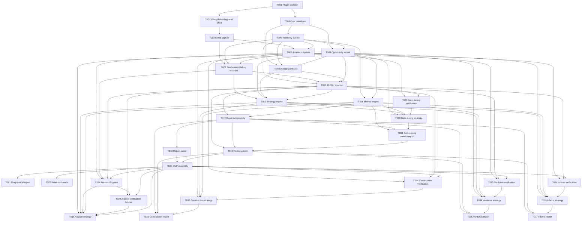

# TickSense Implementation Roadmap Tasks

## Planning Assumptions

### Discovery Summary

- Source of truth: `docs/ARCHITECTURE.md`.
- Repository state at planning time: no production Java code exists yet; the workspace contains only `docs/ARCHITECTURE.md` plus this planning bundle.
- External persistence research was performed against public RuneLite/plugin repositories: RuneLite Developer Guide, plugin-hub README, example-plugin agent guidelines, Ground Markers/Object Markers core plugins, and Inventory Setups.
- Persistence research result: use RuneLite `Config`/`ConfigManager` for plugin settings and small profile-backed values; use TickSense-owned files under `RuneLite.RUNELITE_DIR`/`~/.runelite/ticksense/` for timelines, reports, indexes, and debug bundles.
- Feature bundle path: `features/ticksense-implementation-roadmap/`.
- Planned implementation starts as one Plugin Hub-compatible Java 11 Gradle project. Package boundaries are enforced by Java packages first; Gradle submodules are deferred until the codebase needs them.
- Package root is assumed to be `com.ticksense` because the architecture suggests `com.ticksense` or `dev.ticksense`; pick `com.ticksense` unless the project owner changes it before T001.
- TickSense is planned as a cheap, local-only RuneLite plugin. It works fully offline after installation and has no external-service dependency.
- The local-only hard decisions in this roadmap supersede optional AI/external-service references that still exist in `docs/ARCHITECTURE.md`.
- MVP storage is JSONL timelines plus compact local report JSON and index files under `~/.runelite/ticksense/`.
- Do not add new runtime dependencies unless the owner explicitly approves them. Any proposed dependency must include a justification, Plugin Hub risk assessment, and "requires owner approval" note.
- MVP proves TickSense with one simple, local, automatically detected skilling activity: gem mining.
- Araxxor is the first post-MVP boss milestone. Araxxor verification remains planned, but no MVP task depends on Araxxor.
- Tests should protect behavior: normalized RuneLite event mapping, strategy lifecycle, opportunity terminal states, timing/tick-loss math, replay, report generation, storage compatibility, and regression timelines.

### Planning Invariants

- TickSense is retrospective execution analytics. It answers "How well did I execute?" after an activity; it never tells the player what to do next.
- TickSense must automatically detect activities. Normal users must never manually select, start, stop, or switch an activity.
- Manual activity selection may exist only as a developer/debug override, hidden from normal users and excluded from MVP UX.
- Activity strategies own their activation/start detection and compete through confidence scoring.
- Ambiguous activity detection suppresses normal reports instead of asking the user to choose. If no strategy is confident, TickSense keeps recording generic timeline data without creating a normal activity report.
- Completed reports must include detected activity name, finish reason, confidence, and evidence summary.
- The RuneLite panel may show completed reports only. It must not ask "what activity are you doing?"
- Config may later enable or disable whole activity families, but it must not provide manual per-session activity selection.
- No AI, networking, external services, cloud storage, paid APIs, live mechanic advice, live overlays, input generation, menu mutation, packet inspection, memory reading, runtime-downloaded analyzer code, subprocess control, native/JNI dependencies, arbitrary user-supplied mechanic IDs, or Plugin Hub-risky storage.
- The plugin must run fully offline after installation. Data remains local under RuneLite/TickSense storage.
- MVP storage remains JSONL timelines plus compact local report JSON and index files. Do not plan SQLite, H2, Parquet, or any other database/storage runtime dependency as an implementation task.
- Do not store unbounded timelines, reports, or report indexes in `ConfigManager`; public plugin patterns use `ConfigManager` for settings/small JSON blobs, while TickSense replay data belongs in plugin-owned files.
- Disk I/O must be explicit, bounded, and away from RuneLite hot paths/client-thread work. Appends and reads must tolerate corrupt records without freezing startup.
- Use injected RuneLite-provided Gson where available; do not add JSON/storage dependencies for MVP.
- RuneLite API types stay at the edge in `com.ticksense.runelite`. Core, telemetry, activities, analytics, report models, and storage must not import `net.runelite.*`, Swing UI classes, or live RuneLite objects.
- The RuneLite adapter snapshots values into immutable normalized telemetry and does not perform activity analytics beyond mapping and safe metadata capture.
- Normalized telemetry is Java 11-safe, immutable, JSON-serializable, replayable, schema-versioned, and carries game tick, wall time, monotonic time, client cycle, and client tick sequence where available.
- `MapRegionChanged` must not be used unless later verified in current RuneLite APIs. Region and instance evidence comes from `GameStateChanged`, `WorldViewLoaded`, `WorldViewUnloaded`, `WorldPoint`, and world-view snapshots.
- Activity strategies own activation, termination, metadata, opportunity creation, and strategy-specific report data. The strategy engine arbitrates candidates and lifecycle but does not know activity-specific mechanics.
- Opportunities are central. Metrics should be derived from opportunity instances, activity spans, and completed timelines, not from raw ad hoc counters hidden in UI code.
- Timeline storage appends normalized events and activity/opportunity markers; it does not interpret gameplay.
- Analytics compute completed report metrics only after activity completion. Prefer "unattributed downtime" over false precision.
- UI language is player-facing: ticks, seconds, milliseconds, PB, grade, consistency, tick loss, downtime, best/worst. Avoid exposing "telemetry", "pipeline", "inference", or implementation jargon in normal report views.
- Production logging is quiet. Debug capture is opt-in, bounded, local, and stores normalized events or diagnostics, not RuneLite objects, chat, raw player names, or account identifiers.
- ID registries are source-owned and reviewed. Each committed ID has a source comment or verification note. Unknown IDs may appear only in debug diagnostics inside candidate activities.
- Every strategy emits a finish reason with confidence and evidence. Low-confidence or ambiguous activities should not appear as normal completed reports.
- Tests must not exist solely for coverage. Do not add tests for trivial getters, setters, constructors, enum values, or framework wiring.
- Post-MVP features must preserve local-only safety boundaries.

## MVP Feature Map

| Boundary | MVP Feature | Scope |
|---|---|---|
| RuneLite adapter layer | Plugin skeleton, lifecycle wiring, event subscriptions, clock, snapshotter, mapper tests | Plugin Hub-compatible Java 11 project that observes public RuneLite APIs only. |
| Normalized telemetry | Core primitives, telemetry events, serialization, bus, debug recorder | Immutable event model and JSON shape with no RuneLite objects in core. |
| Activity strategies | Strategy contracts, registry, lifecycle engine, gem mining activity | Activity-owned automatic activation, termination, metadata, opportunities, confidence, and evidence diagnostics. |
| Timeline storage | JSONL timeline repository, markers, schema version, report repository | MVP timeline store with local append/read compatibility, report index, delete-all-data control. |
| Analytics engine | Opportunity model, timing calculators, metric values, report builders | Tick/ms/second calculations, score breakdowns, percentiles, unattributed downtime. |
| Reports/UI | RuneLite side panel, recent reports, detail view, opportunity timeline | Post-activity reports only, no live overlays or mechanic prompts. |
| Replay/golden testing | Replay harness and regression fixtures | Replay/golden timeline testing proves telemetry mapping, strategies, opportunities, storage, metrics, and report output without RuneLite. |

## Post-MVP Feature Map

| Feature | Goal | Depends On | Notes |
|---|---|---|---|
| Araxxor boss analytics | First post-MVP boss milestone for spider engagement and re-engagement analytics. | T014, T029, T015 | Does not block MVP. Requires verified Araxxor evidence before normal reports. |
| Optional developer diagnostics and debug export bundle | Make user-requested debug bundles useful for fixing ID and strategy issues. | T020 | Optional post-MVP tooling, hidden unless debug is enabled. |
| Retention, trends, and report index maintenance | Keep hundreds of reports usable and show stable local trends. | T017, T018, T020 | Maintain JSON/report-index storage; any new runtime dependency requires owner approval. |
| Construction strategy | Prove widget/menu latency analytics. | T024, T032, T033 | Observe menus/widgets only; no menu swaps. |
| Vardorvis strategy | Add projectile/graphic-driven boss response analytics. | T025, T034, T035 | High verification burden for IDs and timing. |
| Inferno strategy | Later/future wave, nibbler, prayer timing, supply, and death-timeline analytics. | T026, T036, T037 | Avoid live solver behavior; keep later than Araxxor/Construction/Vardorvis. |
| Sailing idea | Future idea only. | None | No tasks until content, IDs, and mechanics are stable enough to verify. |

## Proposed Package/Module Ownership

| Package | Owner Responsibility | Primary Tasks |
|---|---|---|
| `com.ticksense.runelite` | Plugin entrypoint, config, RuneLite subscriptions, adapter wiring, clock, snapshotter. | T001, T002, T003, T006, T007, T020 |
| `com.ticksense.core` | Shared primitives such as IDs, time, entity refs, locations, finish reasons, sessions. | T004, T009, T010 |
| `com.ticksense.telemetry` | Normalized event interfaces/classes, categories, JSON serialization, telemetry bus contracts. | T005, T006, T007 |
| `com.ticksense.activities` | Opportunity model, strategy interfaces, registry, candidate arbitration, activity lifecycle. | T008, T009, T011 |
| `com.ticksense.activities.gemmining` | Gem mining verification, strategy, and analyzer. | T023, T030, T031 |
| `com.ticksense.activities.araxxor` | Post-MVP Araxxor IDs, verification gates/fixtures, strategy, spider opportunities, boss report data. | T014, T029, T015 |
| `com.ticksense.activities.construction` | Construction verification, strategy, and analyzer. | T024, T032, T033 |
| `com.ticksense.activities.vardorvis` | Vardorvis verification, strategy, and analyzer. | T025, T034, T035 |
| `com.ticksense.activities.inferno` | Inferno verification, strategy, and analyzer. | T026, T036, T037 |
| `com.ticksense.analytics` | Timing math, metric definitions/values, score breakdowns, report builders. | T016, T031, T033, T035, T037 |
| `com.ticksense.storage` | JSONL timelines, persisted activity/opportunity records, report persistence, indexes, retention, export bundles. | T010, T017, T021, T022 |
| `com.ticksense.ui` | RuneLite panel, report list/detail/timeline views, settings, debug-only UI. | T002, T018, T021, T022 |
| `src/test/java/com/ticksense` | Unit, replay, golden, and adapter mapping tests. | T006, T008-T011, T014-T026, T029-T037 |
| `src/test/resources/replays` | Anonymized JSONL timelines and golden report JSON. | T019, T023-T026, T029, T031, T033, T035, T037 |

## Milestone Plan

| Milestone | Outcome | Tasks | Exit Criteria |
|---|---|---|---|
| M1 - Plugin boots | TickSense is a Plugin Hub-compatible RuneLite plugin with an empty report panel. | T001, T002 | `./gradlew test` passes; `./gradlew run` boots; TickSense appears in the plugin list and panel can open. |
| M2 - Event capture | RuneLite events are observed and timestamped without gameplay interpretation. | T003, T007 | Dev-only debug JSONL can show game ticks, client ticks, clicks, NPC lifecycle, inventory, XP/stat, widgets, and game state. |
| M3 - Normalized telemetry | Core can run without RuneLite and consume serialized telemetry. | T004, T005, T006 | Mapper tests prove key RuneLite events become normalized events with no RuneLite types in core packages. |
| M4 - Activity contracts and storage | Opportunities, strategy contracts, and normalized timelines can be modeled and persisted. | T008, T009, T010 | JSONL append/read compatibility tests pass, including schema version, corrupt-line behavior, and activity/opportunity markers. |
| M5 - Activity engine | Activity strategies and opportunity lifecycle are reusable and testable. | T011 | Synthetic strategy tests cover start, termination, arbitration, opportunity complete/fail/expire/cancel. |
| M6 - Gem mining | Auto-detected skilling activity proves resource-node discovery and RNG-aware reporting. | T023, T030, T031 | A captured or synthetic gem mining session reports detected activity name, finish reason, confidence, evidence summary, rock response, idle ticks, redundant clicks, movement latency, and RNG caveats. |
| M7 - Report panel | Players can review completed reports inside RuneLite. | T018 | Recent reports and detail views show completed reports only; the panel never asks the user what activity they are doing. |
| M8 - Replay/golden confidence | Regression timelines protect behavior before Plugin Hub submission. | T019 | Replay fixtures produce stable golden reports for gem mining, low-confidence suppression, and ambiguous activity suppression. |
| M9 - MVP assembly | The full retrospective pipeline is composed end-to-end from named services. | T020 | A normal activity can be captured, stored, analyzed after completion, saved, and displayed without live guidance. |

## PR-Sized Task Breakdown

| ID | Completed | Title | Description | Github Issue # | Blocked By | Task File |
|---|---|---|---|---|---|---|
| T001 | [x] | Plugin Hub Gradle Skeleton | Create the Java 11 external-plugin project structure, package root, descriptor, properties, and CI baseline. |  | None | [`tasks/T001.md`](tasks/T001.md) |
| T002 | [x] | Plugin Lifecycle, Config, and Panel Shell | Add the RuneLite plugin entrypoint lifecycle, config interface, empty report panel, and nav button without analytics. |  | T001 | [`tasks/T002.md`](tasks/T002.md) |
| T003 | [x] | RuneLite Event Capture Surface | Subscribe to MVP RuneLite events and capture ordered timestamp/context envelopes without activity interpretation. |  | T002 | [`tasks/T003.md`](tasks/T003.md) |
| T004 | [x] | Core Domain Primitives | Add Java 11-safe immutable primitives for time, entity refs, locations, sessions, activity IDs, and finish reasons. |  | T001 | [`tasks/T004.md`](tasks/T004.md) |
| T005 | [x] | Normalized Telemetry Events and Serialization | Define normalized telemetry interfaces/classes, event categories, payloads, schema versioning, and JSON serialization. |  | T004 | [`tasks/T005.md`](tasks/T005.md) |
| T006 | [x] | Adapter Mappers and Snapshot Tests | Map MVP RuneLite events into normalized telemetry snapshots and test that no RuneLite types leak into core models. |  | T003, T005 | [`tasks/T006.md`](tasks/T006.md) |
| T007 | [x] | Telemetry Bus, Session Clock, and Debug Recorder | Fan out normalized events, track session/tick sequencing, and write bounded opt-in debug JSONL. |  | T003, T005, T006 | [`tasks/T007.md`](tasks/T007.md) |
| T008 | [x] | Opportunity Model and Tracker | Add opportunity definitions, instances, evidence, terminal states, latency helpers, and lifecycle tests. |  | T004, T005 | [`tasks/T008.md`](tasks/T008.md) |
| T009 | [x] | Activity Strategy Contracts and Registry | Define strategy interfaces, markers, candidate confidence, and a registry/factory for strategies. |  | T004, T005, T008 | [`tasks/T009.md`](tasks/T009.md) |
| T010 | [x] | JSONL Timeline Repository | Persist and read schema-versioned normalized timelines plus activity/opportunity markers with local JSONL storage. |  | T005, T007, T008, T009 | [`tasks/T010.md`](tasks/T010.md) |
| T011 | [x] | Activity Strategy Engine Lifecycle | Implement candidate arbitration, active-session lifecycle, termination handling, and diagnostics emission. |  | T007, T008, T009, T010 | [`tasks/T011.md`](tasks/T011.md) |
| T016 | [x] | Metrics Engine and Timing Calculators | Add reusable tick/ms/second calculators, percentiles, score breakdowns, and metric value models. |  | T005, T008 | [`tasks/T016.md`](tasks/T016.md) |
| T017 | [x] | Report Model and Repository | Define stable report models, summaries, JSON persistence, report index, and delete-all-data storage control. |  | T010, T016 | [`tasks/T017.md`](tasks/T017.md) |
| T023 | [x] | Gem Mining Registry and Verification Fixtures | Verify gem mining evidence and create primitive ID registries and fixtures. |  | T006, T010 | [`tasks/T023.md`](tasks/T023.md) |
| T030 | [x] | Gem Mining Strategy and Opportunities | Detect gem mining activity and resource-node opportunities using verified telemetry. |  | T008, T011, T016, T023 | [`tasks/T030.md`](tasks/T030.md) |
| T031 | [ ] | Gem Mining Metrics and Report Data | Generate gem mining metrics and report data for local report JSON. |  | T016, T017, T030 | [`tasks/T031.md`](tasks/T031.md) |
| T018 | [x] | RuneLite Report Panel and Detail Views | Display recent reports, activity summaries, opportunity timelines, and tick-loss breakdowns in RuneLite UI. |  | T017 | [`tasks/T018.md`](tasks/T018.md) |
| T019 | [ ] | Replay and Golden Timeline Harness | Add replay loaders, synthetic event builders, and golden report fixtures for gem mining and ambiguous detection suppression. |  | T010, T017, T031 | [`tasks/T019.md`](tasks/T019.md) |
| T020 | [ ] | MVP End-to-End Assembly and Plugin Hub Readiness | Compose capture, telemetry, strategy engine, storage, analytics, report repository, and panel into the retrospective MVP flow. |  | T018, T019 | [`tasks/T020.md`](tasks/T020.md) |
| T014 | [ ] | Araxxor ID Registry and Verification Gates | Create source-owned Araxxor ID registries and post-MVP gates for unverified mechanics. |  | T006, T007, T010, T020 | [`tasks/T014.md`](tasks/T014.md) |
| T029 | [ ] | Araxxor Verification Capture Fixtures | Capture normalized Araxxor verification fixtures or keep Araxxor blocked from normal reports. |  | T010, T014, T020 | [`tasks/T029.md`](tasks/T029.md) |
| T015 | [ ] | Araxxor Strategy and Spider Opportunities | Add post-MVP Araxxor spider engagement, re-engagement, damage, and finish-reason analytics. |  | T008, T011, T014, T016, T029, T020 | [`tasks/T015.md`](tasks/T015.md) |
| T021 | [ ] | Optional Developer Diagnostics and Debug Export Bundle | Add optional post-MVP developer diagnostics panel and user-requested debug bundle export. |  | T020 | [`tasks/T021.md`](tasks/T021.md) |
| T022 | [ ] | Retention, Trends, and Report Index Maintenance | Add report retention, index rebuild/compaction, and local trend summaries for recent reports. |  | T017, T018, T020 | [`tasks/T022.md`](tasks/T022.md) |
| T024 | [ ] | Construction Registry and Verification Fixtures | Verify Construction menu/widget evidence and create primitive ID registries and fixtures. |  | T006, T010, T020 | [`tasks/T024.md`](tasks/T024.md) |
| T032 | [ ] | Construction Strategy and Opportunities | Detect one verified Construction method and observe-only menu/cadence opportunities. |  | T008, T011, T016, T024 | [`tasks/T032.md`](tasks/T032.md) |
| T033 | [ ] | Construction Metrics and Golden Report | Generate Construction reports and golden replay coverage. |  | T017, T019, T032 | [`tasks/T033.md`](tasks/T033.md) |
| T025 | [ ] | Vardorvis Registry and Verification Fixtures | Verify Vardorvis mechanic evidence before reporting timings. |  | T006, T010, T020 | [`tasks/T025.md`](tasks/T025.md) |
| T034 | [ ] | Vardorvis Strategy and Opportunities | Detect verified Vardorvis mechanic opportunities without live solving. |  | T008, T011, T016, T025 | [`tasks/T034.md`](tasks/T034.md) |
| T035 | [ ] | Vardorvis Metrics and Golden Report | Generate Vardorvis reports and golden replay coverage. |  | T017, T019, T034 | [`tasks/T035.md`](tasks/T035.md) |
| T026 | [ ] | Inferno Registry and Verification Fixtures | Verify Inferno wave, NPC, prayer, supply, and death evidence. |  | T006, T010, T020 | [`tasks/T026.md`](tasks/T026.md) |
| T036 | [ ] | Inferno Strategy and Spans | Detect verified Inferno waves, nested spans, and opportunities without live solving. |  | T008, T011, T016, T026 | [`tasks/T036.md`](tasks/T036.md) |
| T037 | [ ] | Inferno Metrics and Golden Report | Generate Inferno wave/attempt reports and golden replay coverage. |  | T017, T019, T036 | [`tasks/T037.md`](tasks/T037.md) |

## Dependency Graph

## Testing Plan

- Normalized mapping tests: assert `MenuOptionClicked`, `MenuEntryAdded`, `MenuOpened`, `NpcSpawned`, `NpcDespawned`, `NpcChanged`, `InteractingChanged`, `AnimationChanged`, `HitsplatApplied`, `ItemContainerChanged`, `StatChanged`, `GameTick`, `ClientTick`/`PostClientTick`, widget events, game state, and world-view snapshots map into normalized telemetry without RuneLite types in payloads.
- Strategy lifecycle tests: assert candidate confidence, start, active persistence, termination, ambiguous suppression, nested spans, and strategy tie-breakers using pure Java synthetic events.
- Opportunity tests: assert `OPEN`, `COMPLETED`, `FAILED`, `EXPIRED`, and `CANCELLED` behavior, plus latency ticks/millis and evidence capture.
- Timing/tick-loss tests: assert game tick, client tick, wall-clock, monotonic-duration, idle tick, downtime, percentile, and score calculations with deterministic timestamps.
- Timeline replay tests: read JSONL fixtures from `src/test/resources/replays/`, run the same strategy/analytics pipeline, and compare to golden JSON reports.
- Report generation tests: assert gem mining reports include detected activity name, finish reason, confidence, evidence summary, required metrics, opportunity timelines, unattributed downtime, and player-facing labels.
- Storage compatibility tests: append/read JSONL, activity markers, schema version handling, corrupt-line handling, report save/find/list, index rebuild, and delete-all-data.
- Regression fixtures: keep known MVP timelines for `gem-mining-basic.jsonl` and ambiguous low-confidence timelines that must not create normal reports.
- Do not add tests for trivial getters/setters/constructors/enums/framework wiring. Tests must protect behavior that could regress.

## Risks and Mitigations

| Risk | Mitigation |
|---|---|
| RuneLite API drift or Java version mismatch | Start from the official external plugin template, use Java 11-safe code, and keep API touchpoints isolated in `com.ticksense.runelite`. |
| RuneLite types leaking into core | Add adapter mapping tests and import-boundary checks in review; core packages must not import `net.runelite.*`. |
| Automatic activity detection is ambiguous | Suppress normal reports, keep generic timeline data, and include diagnostics only in debug tooling rather than asking users to choose an activity. |
| Araxxor IDs or spider attackability are not reliably visible | Araxxor is post-MVP; T029 can keep Araxxor blocked from normal reports without affecting the first release. |
| Strategy engine becomes a god class | Keep activity-specific logic in strategies and use small engine responsibilities: registry, arbitration, lifecycle, dispatch. |
| Reports overclaim precision | Include confidence/evidence, preserve unattributed downtime, and label probabilistic data as "likely" only when conservative rules pass. |
| Storage grows too large | MVP uses JSONL plus compact reports; post-MVP T022 adds retention and index maintenance. |
| ConfigManager becomes an accidental database | Store only settings/small profile-backed values in `ConfigManager`; keep timeline/report/index files under `~/.runelite/ticksense/` with bounded reads and corrupt-record handling. |
| Debug capture leaks sensitive information | Store normalized events only, avoid chat/player names, bound file size/session count, and keep debug off by default. |
| UI drifts into live helper behavior | T018 is report-only and post-completion; no overlays, no real-time prompts, no sounds in MVP. |
| Local data privacy or storage misuse | Keep data local under RuneLite/TickSense storage, avoid chat/player names/account identifiers, provide delete-all-data and export controls, and do not add external services. |

Removed task traceability:

- T028 was deleted because AI payloads, AI interfaces, and future AI hooks are out of scope.
- T040 was deleted because networking, external services, paid APIs, and AI network clients are out of scope.
- T027, T038, and T039 were deleted because Sailing is only a future idea until content, IDs, and mechanics are stable enough to verify.
- T012 and T013 were deleted because herb cleaning is no longer planned as a TickSense activity.

## First 10 Issues to Create

1. T001 - Plugin Hub Gradle Skeleton
2. T002 - Plugin Lifecycle, Config, and Panel Shell
3. T003 - RuneLite Event Capture Surface
4. T004 - Core Domain Primitives
5. T005 - Normalized Telemetry Events and Serialization
6. T006 - Adapter Mappers and Snapshot Tests
7. T007 - Telemetry Bus, Session Clock, and Debug Recorder
8. T008 - Opportunity Model and Tracker
9. T009 - Activity Strategy Contracts and Registry
10. T010 - JSONL Timeline Repository
